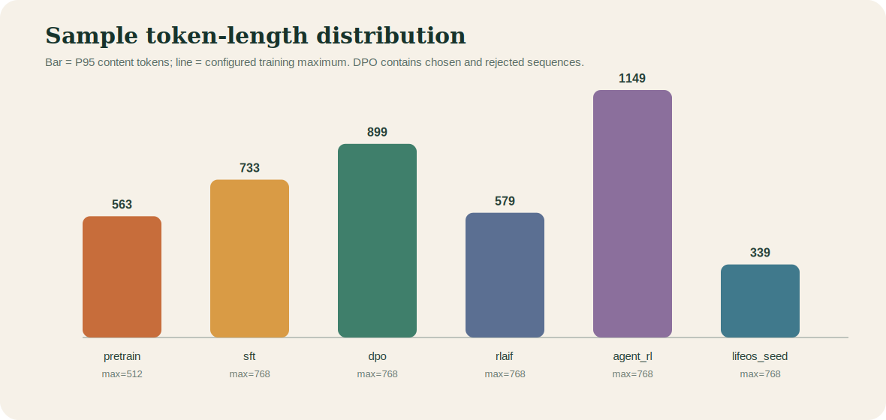
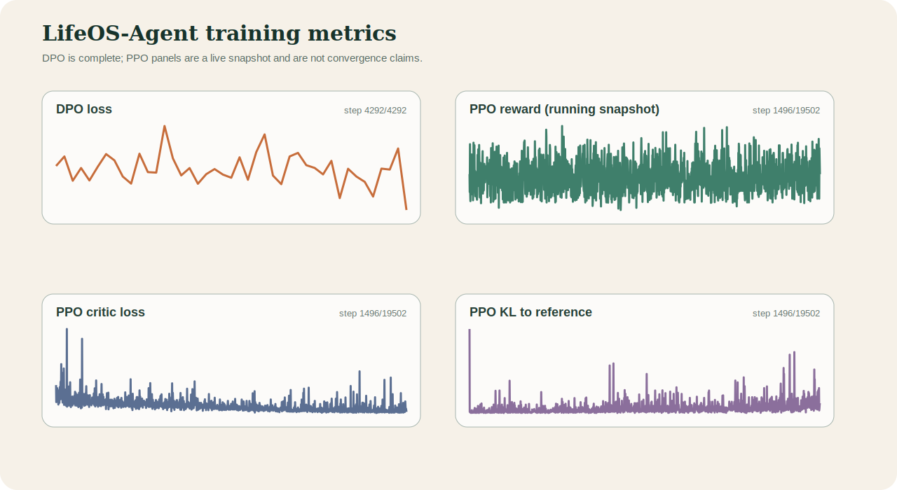

# MiniMind 训练数据、张量维度与 Loss 全景分析

> 分析日期：2026-07-12
>
> 分析方法：流式扫描全部 JSONL；每份数据使用固定随机种子抽样 2,000 行进行 tokenizer 长度统计。全量数据不会载入内存。

## 1. 核心发现



| 数据 | 行数 | Token P50 | Token P95 | 配置上限 | 估计超限率 | 主要训练目标 |
|---|---:|---:|---:|---:|---:|---|
| Pretrain | 1,270,238 | 215 | 563 | 512 | 6.10% | 全 token 次词预测 |
| SFT | 905,718 | 471 | 733 | 768 | 3.15% | 只监督 assistant token |
| DPO | 17,166 | 431 | 899 | 768 | 14.68% | chosen 相对 rejected 偏好 |
| RLAIF | 19,502 | 301 | 579 | 768 | 0.00% | PPO/GRPO 在线 rollout prompt |
| Agent RL | 39,988 | 447 | 1,149 | 768 | 22.05% | 多轮工具轨迹与延迟奖励 |
| LifeOS seed | 26 | 124 | 339 | 768 | 0.00% | Tool Calling SFT 行为 |

最重要的工程结论：

1. Agent RL 是当前长度风险最大的集合。内容 token 近似统计中约 22.05% 超过 768；加入 chat template 和工具 schema 后，真实 prompt 可能更长。
2. DPO 的 chosen/rejected 约 14.68% 超过 768。截断可能切掉回答尾部，使 chosen 与 rejected 的有效偏好信号不完整。
3. SFT 的 P95 为 733，接近 768 上限；模板 token 会进一步抬高实际长度。
4. RLAIF prompt 全部落在 768 以内，适合当前 PPO 输入上限；但 rollout 还会追加最多 256 token。
5. LifeOS seed 很短且工具轨迹比例高，适合行为注入，但 26 条样本不足以代表真实用户分布。

## 2. 数据质量体检

全量流式检查结果：

| 数据 | 非法 JSON | 必需字段缺失 | 空文本 | 工具样本比例 | GT 覆盖 |
|---|---:|---:|---:|---:|---:|
| Pretrain | 0 | 0 | 0 | 0% | 0% |
| SFT | 0 | 0 | 0 | 9.37% | 0% |
| DPO | 0 | 0 | 0 | 0% | 0% |
| RLAIF | 0 | 0 | 0 | 0% | 0% |
| Agent RL | 0 | 0 | 0 | 50.02% | 50.02% |
| LifeOS seed | 0 | 0 | 0 | 69.23% | 0% |

抽样重复检查发现：SFT 2,000 行样本中有 9 条重复，RLAIF 有 2 条，Agent RL 有 14 条。它只说明抽样内存在完全相同行，不能直接外推全量重复比例；如果要做去重，应另建全量 hash 索引，而不是把整个 JSONL 载入内存。

## 3. 统计口径

本文的 token 长度来自 MiniMind tokenizer 对样本内容字段的编码：

```python
token_length = len(tokenizer(text, add_special_tokens=False).input_ids)
```

这是跨数据集可比的“内容长度”，不等于训练时最终长度。真实训练还会增加：

- `<|im_start|>`、role、`<|im_end|>` 等 chat template token；
- system prompt；
- tools JSON schema；
- `<tool_call>` / `<tool_response>`；
- BOS/EOS；
- PPO/GRPO 在线生成的 completion。

因此本文的超限率是保守近似，尤其会低估 Tool Calling SFT 和 Agent RL 的真实长度。

## 4. Pretrain

### 数据格式

```json
{"text": "一段连续文本"}
```

### 张量

`PretrainDataset(max_length=512)` 执行：

```text
原始 tokens                    [L]
BOS + tokens + EOS             [min(L+2, 512)]
padding 后 input_ids            [512]
DataLoader 后                  [B, 512]
模型 hidden                    [B, 512, 768]
logits                         [B, 512, V]
labels                         [B, 512]
```

padding 位置的 label 被设为 `-100`，交叉熵忽略这些位置。

### Loss

$$
\mathcal L_{pretrain}=-\frac{1}{N}\sum_{b,t:\,y_{b,t}\ne-100}
\log p_\theta(y_{b,t}\mid x_{b,<t})
$$

Pretrain 的几乎所有非 padding token 都参与 loss。P95 内容长度 563 高于 512，说明长文本尾部有约 6.10% 的样本可能被截断。

## 5. SFT

### 数据格式

```json
{
  "conversations": [
    {"role":"system","content":"...","tools":"[...]"},
    {"role":"user","content":"..."},
    {"role":"assistant","tool_calls":"[...]"},
    {"role":"tool","content":"..."},
    {"role":"assistant","content":"最终答案"}
  ]
}
```

### 张量

```text
chat template 文本             str
input_ids                      [B, 768]
labels                         [B, 768]
assistant 位置                 token id
system/user/tool/pad 位置       -100
logits                         [B, 768, V]
loss                           scalar
```

`SFTDataset.generate_labels()` 搜索 assistant 的开始和结束标记，只复制 assistant 范围到 labels，其余位置保持 `-100`。

### Loss

$$
\mathcal L_{SFT}=-\frac{1}{N_{assistant}}
\sum_{(b,t)\in assistant}\log p_\theta(y_{b,t}\mid x_{b,<t})
$$

这意味着 tools schema、用户问题和 tool response 是条件，不直接作为预测目标；`<tool_call>` 与最终回答位于 assistant 消息中，会直接参与监督。

当前 SFT 数据约 9.37% 包含 tools/tool_calls/tool role。它提供通用 Tool Calling 能力；LifeOS seed 则用更高的 69.23% 工具轨迹比例强化项目专属行为。

## 6. DPO

### 数据格式

```json
{
  "chosen": [{"role":"user","content":"..."},{"role":"assistant","content":"更好回答"}],
  "rejected": [{"role":"user","content":"..."},{"role":"assistant","content":"较差回答"}]
}
```

### 张量

设原始 batch 为 $B$，序列长度为 $T=768$：

```text
x_chosen, y_chosen             [B, T-1]
x_rejected, y_rejected         [B, T-1]
拼接后的 x, y                  [2B, T-1]
policy/ref logits              [2B, T-1, V]
per-token log probabilities    [2B, T-1]
assistant loss mask            [2B, T-1]
chosen/rejected sequence score [B], [B]
DPO loss                       scalar
```

### Loss

先把 assistant mask 内的 token log probability 求和：

$$
s_\theta(x,y)=\sum_t m_t\log\pi_\theta(y_t\mid x,y_{<t})
$$

然后比较 policy 与 reference 的偏好差：

$$
\mathcal L_{DPO}=-\log\sigma\left(
\beta[(s_\theta^+-s_\theta^-)-(s_{ref}^+-s_{ref}^-)]
\right)
$$

本项目完成 `4292/4292` 步，最终 DPO loss 为 `0.3030`。DPO loss 不是语言模型困惑度；它衡量 policy 是否比 reference 更偏向 chosen。

## 7. PPO / RLAIF

### 数据如何使用

`RLAIFDataset` 丢弃 conversations 的最后一个 assistant 答案，只把前文渲染成 prompt。模型在线生成新回答，因此训练对象不是数据里的固定答案。

设 prompt 长度为 $P$、生成长度为 $R\le256$：

```text
prompt input_ids                [B, P]
generated sequence             [B, P+R]
completion_ids                 [B, R]
old/policy/ref log probabilities [B, R]
critic values                  [B, R]
rewards                        [B]
advantages / returns           [B, R]
```

### Reward

当前 reward 由以下项组成：

```text
reward model score
+ 长度奖励/惩罚
+ thinking 长度和闭合奖励
- 重复 n-gram 惩罚
```

### Actor loss

$$
r_t(\theta)=\exp(\log\pi_\theta-\log\pi_{old})
$$

$$
\mathcal L_{actor}=\operatorname{mean}\left[
\max(-A_tr_t,-A_t\operatorname{clip}(r_t,1-\epsilon,1+\epsilon))
\right]+\lambda_{KL}D_{KL}(\pi_\theta\|\pi_{ref})
$$

### Critic loss

$$
\mathcal L_V=\frac12\max\left[(V-R)^2,
(\operatorname{clip}(V,V_{old}-\epsilon_V,V_{old}+\epsilon_V)-R)^2\right]
$$

当前远程 PPO 已真实输出 Reward、KL_ref、Approx KL、ClipFrac、Critic Loss 和 Avg Response Len。早期 reward 在正负之间波动是 rollout 数据差异，不应只看单步值判断收敛。

## 8. GRPO

GRPO 使用相同 RLAIF prompt，但每个 prompt 生成 $G=4$ 条 completion：

```text
prompts                        [B, P]
completions                    [B*G, R]
rewards                        [B*G]
grouped rewards                [B, G]
advantages                     [B*G]
per-token log probabilities    [B*G, R]
completion mask                [B*G, R]
policy loss                    scalar
```

组内标准化优势：

$$
A_i=\frac{r_i-\mu_{group}}{\sigma_{group}+10^{-4}}
$$

GRPO/CISPO loss 只在 completion mask 上计算，不训练 prompt token。若同组 reward 方差接近 0，优势也接近 0，几乎没有有效更新信号。

## 9. Agent RL

Agent RL 的输入不是单一 prompt 字符串，而是：

```python
{"messages": messages, "tools": tools, "gt": gt}
```

每个问题生成 4 条多轮轨迹，每条最多 3 轮工具调用：

```text
messages + tools               Python objects
每条轨迹 prompt tokens         P_i
所有 response tokens           R_i
packed input_ids               [B*G, max(P_i+R_i)]
response mask                  [B*G, max_len-1]
reward                         [B*G]
group advantages               [B*G]
policy/ref log probabilities   [B*G, max_len-1]
```

Agent reward 包含：

- `<tool_call>` 标签是否闭合；
- 工具名是否在候选 schema；
- arguments 是否通过对应校验；
- 工具调用数量与 GT 数量是否对齐；
- 最终答案是否命中 GT；
- 轨迹是否未完成；
- 重复文本惩罚；
- 无工具样本可附加 reward model 分数。

工具轨迹的总 reward 被 clip 到 $[-3,3]$。由于 Agent RL 的 P95 内容长度为 1,149，而当前 `max_seq_len=768`、`max_total_len=1600`，需要分别关注初始 prompt 截断和多轮轨迹尾部截断。

## 10. Loss 不能直接横向比较



### 实际日志快照

DPO 日志每 100 step 记录一次，共解析 43 个点：

```text
first logged loss    0.6259
last loss            0.3030
logged mean          0.6017
logged min / max     0.3030 / 0.9189
status               4292 / 4292 complete
```

PPO 日志快照解析到 step 1,496；这是训练中快照，不是最终曲线：

```text
reward mean                  -1.5321
reward last-100 mean         -1.4316
reward min / max             -3.7500 / 1.8115
KL_ref mean                   0.00629
KL_ref last-100 mean          0.01222
critic loss first / last      0.7153 / 0.0326
critic loss last-100 mean     0.0903
average response length       142.0 tokens
```

早期 critic loss 明显下降，说明 value head 正在拟合 return；但 reward 的 last-100 均值只比全局均值略高，不能据此宣称策略收敛。`KL_ref` 的近期均值上升也需要持续监控，以防策略逐渐偏离 DPO reference。

| 指标 | 含义 | 是否越低越好 |
|---|---|---|
| Pretrain/SFT CE | 正确 token 的负对数似然 | 验证集内通常是 |
| DPO loss | chosen 相对 rejected 的偏好分类 | 同一 beta/数据内参考 |
| PPO actor loss | clipped advantage + KL | 单值不代表质量 |
| PPO critic loss | value 对 return 的拟合误差 | 需结合 reward/KL |
| GRPO policy loss | 组内优势加权策略损失 | 需结合 reward 方差 |
| Agent RL loss | 轨迹优势加权策略损失 | 需结合任务成功率 |

不能用“PPO loss 比 SFT loss 小”得出 PPO 更好，因为目标、mask、样本单位和数值尺度完全不同。

## 11. 建议

1. 把 Agent RL 的 `max_seq_len` 提升到 1024 做显存试验，或按模板后 token 长度过滤/分桶；当前 768 可能截断约五分之一长样本。
2. DPO 对超长 pair 做一致截断检查，确保 chosen/rejected 都保留关键回答结尾。
3. 给 SFT 统计真实 template 后长度和 assistant 有效 token 比例，而不仅是内容长度。
4. PPO/GRPO 监控 reward 均值、reward 方差、KL、响应长度和重复率；不要只监控 loss。
5. Agent RL 重点报告工具名正确率、参数合法率、执行成功率、GT 命中率和未完成率。
6. LifeOS seed 扩展到至少 200 条去重场景，并保留 20% 普通聊天负样本，降低“逢问必调工具”的风险。

## 12. 重现分析

```bash
python scripts/analyze_training_data.py --sample_size 2000
python scripts/analyze_training_logs.py
```

产物：

```text
analysis/training_data_analysis.json
analysis/training_log_analysis.json
docs/assets/training_data_token_lengths.svg
docs/assets/training_metrics.svg
DATA_AND_LOSS_ANALYSIS.md
```
