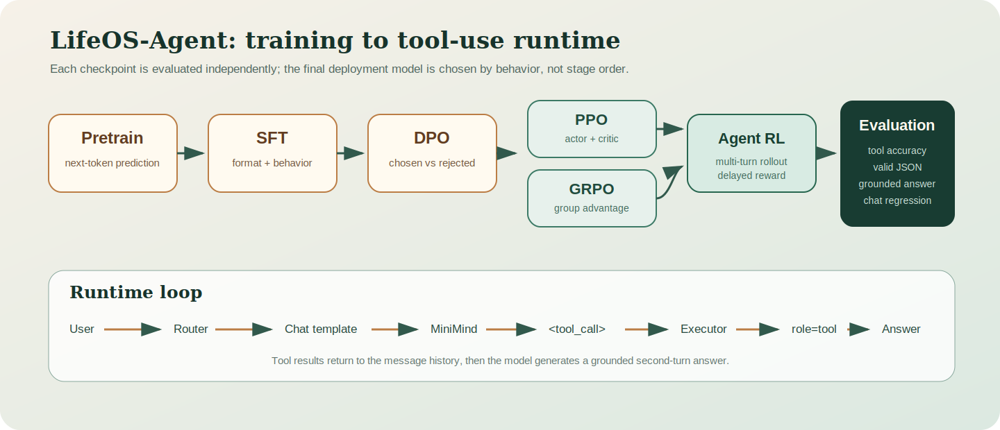
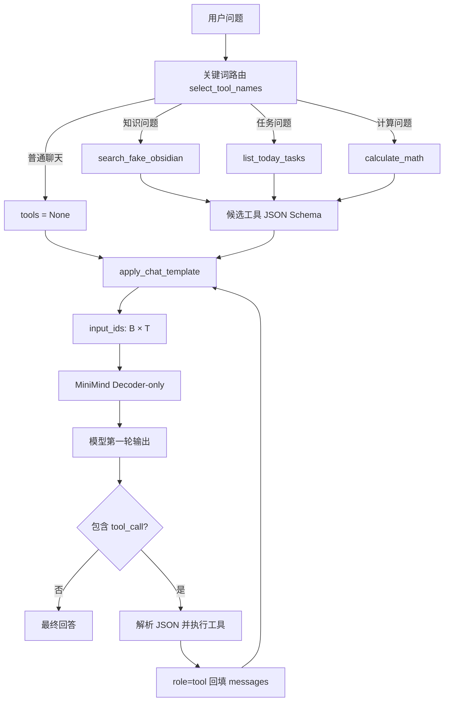
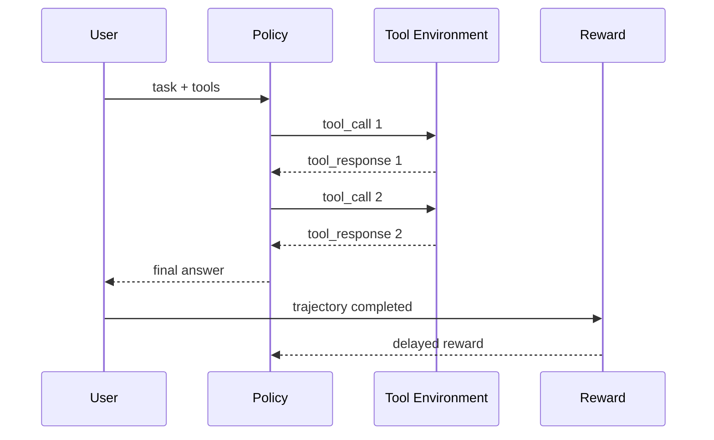

# LifeOS-Agent：从 MiniMind SFT 到 Tool Calling 与 Agent RL

> 最终阅读版项目报告
>
> 更新时间：2026-07-12
>
> 项目仓库：<https://github.com/caiusy/LifeOS-Agent>

## 1. 项目结论

LifeOS-Agent 已经完成一个可运行的 Tool Calling Agent 闭环：用户问题经过轻量路由后，只把相关工具 schema 交给 MiniMind；模型生成 `<tool_call>`；Python 外部程序解析和执行工具；结果以 `role="tool"` 回填；模型在第二轮生成基于工具结果的最终回答。

当前已经验证并产出：

- MiniMind 63.9M 参数模型的本地 `.pth` 推理。
- Fake Obsidian 笔记搜索、今日任务、数学计算三个工具。
- 普通聊天不注入 tools schema。
- 最多三轮工具调用，避免无限循环。
- SFT、增量 SFT、DPO 完整训练 checkpoint。
- PPO、GRPO、Agent RL 串行训练 worker；奖励模型传输完成后自动继续。
- 输入 token、生成 token、消息数量、工具数量和回填过程的维度日志。

## 2. 系统全景





核心代码：

| 文件 | 作用 |
|---|---|
| `lifeos_agent/main.py` | 模型加载、chat template、生成、解析、外部循环和维度日志 |
| `lifeos_agent/router.py` | 根据问题选择候选工具 |
| `lifeos_agent/tools.py` | 工具 schema、安全数学计算和统一执行入口 |
| `lifeos_agent/fake_notes.py` | 内置假笔记与 Top 3 检索 |
| `scripts/build_lifeos_sft_mix.py` | 官方 SFT 与 LifeOS seed 混合、工具 schema 归一化 |
| `scripts/remote_rl_worker.sh` | DPO 后串行执行 PPO、GRPO、Agent RL |

## 3. 一次工具调用的真实过程

问题：

```text
17.66 涨停价是多少？
```

路由结果：

```python
candidate_tool_names = ["calculate_math"]
tools = get_tools_by_names(candidate_tool_names)
```

模型看到的工具 schema 包含：

```json
{
  "name": "calculate_math",
  "parameters": {
    "type": "object",
    "properties": {
      "expression": {"type": "string"}
    },
    "required": ["expression"]
  }
}
```

模型第一轮输出：

```xml
<tool_call>
{"name":"calculate_math","arguments":{"expression":"round(17.66 * 1.1, 2)"}}
</tool_call>
```

外部程序执行：

```python
tool_calls = parse_tool_calls(response)
result = execute_tool("calculate_math", {"expression": "round(17.66 * 1.1, 2)"})
# {"result": 19.43}
```

回填消息：

```python
messages.append({"role": "assistant", "content": response})
messages.append({"role": "tool", "content": '{"result": 19.43}'})
```

模型第二轮回答：

```text
按 A 股普通股票默认 10% 涨停来算，17.66 的涨停价是 19.43。
```

## 4. 输入输出维度

设：

- batch size 为 $B$；
- token 长度为 $T$；
-隐藏维度为 $D=768$；
- attention heads 为 $H$；
- 单头维度为 $d_h=D/H$；
- 词表大小为 $V$。

主要张量：

```text
input_ids                 [B, T]
attention_mask            [B, T]
token embeddings          [B, T, D]
Q / K / V                 [B, H, T, d_h]
attention scores          [B, H, T, T]
hidden states             [B, T, D]
logits                    [B, T, V]
labels                    [B, T]
loss                      scalar
generated_ids             [B, T + R]
response_ids              [B, R]
```

Scaled Dot-Product Attention：

$$
\operatorname{Attention}(Q,K,V)=
\operatorname{softmax}\left(\frac{QK^\top}{\sqrt{d_h}}+M\right)V
$$

$M$ 是因果 mask，第 $t$ 个 token 不能读取未来 token。

教学日志默认开启，会输出：

```text
messages=2, tools=1, chars=...
input_ids.shape=(1, T)
attention_mask.shape=(1, T)
generated_ids.shape=(1, T+R)
response_tokens=R
parsed_calls=1
messages_after_tool=4
```

## 5. 数据资产

本项目已经检查的数据：

| 数据 | 记录数 | 用途 |
|---|---:|---|
| `pretrain_t2t_mini.jsonl` | 1,270,238 | 语言模型预训练 |
| `sft_t2t_mini.jsonl` | 905,718 | 指令与对话 SFT |
| `dpo.jsonl` | 17,166 | chosen/rejected 偏好训练 |
| `agent_rl.jsonl` | 39,988 | 多轮工具调用 Agent RL |
| `lifeos_sft_seed.jsonl` | 26 | LifeOS 专用工具行为种子 |

LifeOS 混合数据不是简单拼接。`build_lifeos_sft_mix.py` 会从 `tool_calls` 提取真实工具名，只把相关 schema 注入对应样本，避免所有工具每条样本都进入 prompt。

## 6. SFT

SFT 让模型模仿正确答案和正确工具格式。对于输入 $x$ 与目标回答 $y=(y_1,\ldots,y_T)$：

$$
\mathcal L_{SFT}=-\sum_{t=1}^{T}\log p_\theta(y_t\mid x,y_{<t})
$$

Tool Calling SFT 需要同时覆盖：

1. 有工具问题输出正确 `<tool_call>`。
2. 工具名来自当前 schema。
3. arguments 是合法 JSON object。
4. 收到 `role=tool` 后生成自然语言答案。
5. 普通聊天不调用工具。

已完成权重：

```text
full_sft_768.pth
lifeos_sft_768.pth
lifeos_agent_best_768.pth
lifeos_agent_v4_768.pth
```

v4 增量 SFT 共完成 `2975/2975` 步，最终记录 loss 为 `1.2131`。

## 7. DPO

DPO 使用同一 prompt 下的偏好回答 $y^+$ 和较差回答 $y^-$，不单独训练 reward model：

$$
\mathcal L_{DPO}=-\log\sigma\left(\beta\left[
\log\frac{\pi_\theta(y^+\mid x)}{\pi_{ref}(y^+\mid x)}-
\log\frac{\pi_\theta(y^-\mid x)}{\pi_{ref}(y^-\mid x)}
\right]\right)
$$

本项目 DPO：

```text
基础权重：lifeos_agent_v4_768.pth
数据：17,166 条 dpo.jsonl
步数：4292 / 4292
最终 DPO loss：0.3030
输出：lifeos_agent_dpo_v1_768.pth
```

DPO checkpoint 位于：

```text
/home/caius/minimind/out/lifeos_agent_dpo_v1_768.pth
```

## 8. PPO

PPO 在线采样回答，reward model 对回答打分，critic 估计价值。概率比：

$$
r_t(\theta)=\frac{\pi_\theta(a_t\mid s_t)}{\pi_{old}(a_t\mid s_t)}
$$

裁剪目标：

$$
L^{CLIP}=\mathbb E_t\left[
\min\left(r_t(\theta)A_t,
\operatorname{clip}(r_t(\theta),1-\epsilon,1+\epsilon)A_t\right)
\right]
$$

优势用 GAE 估计：

$$
A_t=\sum_{l=0}^{\infty}(\gamma\lambda)^l
\left(r_{t+l}+\gamma V(s_{t+l+1})-V(s_{t+l})\right)
$$

PPO 显存开销较高，因为同时维护 actor、reference、critic 和 reward model。本项目在 3090 Ti 上采用 `batch_size=1`、`max_gen_len=256`。

远程环境使用 Transformers 5.x 时，InternLM2-Reward 的自动 fast tokenizer 转换可能失败，而且默认 RoPE 会从旧版 `None` 归一化为 `{"rope_type":"default"}`，与模型的 Transformers 4.x custom code 不兼容。项目的兼容补丁会指定 `use_fast=False`，并在加载前把 default RoPE 恢复为原始 `None` 语义。

为避免改变现有 `lead-3d` 环境，RL 阶段使用独立环境 `/home/caius/minimind/.venv-lifeos`，固定 `transformers==4.57.6` 和 `tokenizers==0.22.2`。这个组合既能读取 MiniMind 的新版 tokenizer JSON，也保留 reward custom model 所依赖的 `DynamicCache.from_legacy_cache`。冒烟测试已成功加载 reward model 并得到 reward score `-0.537109375`。

## 9. GRPO

GRPO 对同一 prompt 生成一组 $G$ 个回答，以组内相对奖励替代独立 critic：

$$
\hat A_i=\frac{r_i-\operatorname{mean}(r_1,\ldots,r_G)}
{\operatorname{std}(r_1,\ldots,r_G)+\epsilon}
$$

本项目配置 `num_generations=4`。每个 prompt 的四条回答分别得到 reward，再计算组内优势并更新策略。

## 10. Agent RL

Agent RL 与普通单轮 RL 的区别是 reward 在完整轨迹结束后结算：



一个可解释的 LifeOS reward 可以写成：

$$
r=0.30r_{tool}+0.25r_{args}+0.20r_{exec}
+0.20r_{grounded}+0.05r_{no\ unnecessary\ tool}
$$

其中必须包含“普通聊天不调用工具”的奖励，否则模型容易通过无条件输出 `<tool_call>` 钻奖励函数的空子。

## 11. 验收结果

### 笔记检索

```text
输入：我之前学 SFTDataset 学到哪了？
候选工具：search_fake_obsidian
结果：成功检索 SFTDataset，并在第二轮总结 chat template、tools、tool_calls、tool response。
```

### 今日任务

```text
输入：我今天应该做什么？
候选工具：list_today_tasks
结果：工具调用与回填成功；模型原始回答有重复时由 deterministic fallback 修正。
```

### 数学计算

```text
输入：17.66 涨停价是多少？
候选工具：calculate_math
工具结果：19.43
最终回答：正确。
```

### 普通聊天

```text
输入：你好，简单介绍一下你自己
候选工具：[]
tools：None
结果：prompt 不包含工具 schema，走普通聊天路径。
```

## 12. 运行方法

远程对话：

```bash
ssh wsl-dev
source /home/caius/lead-3d/venv/bin/activate
cd /home/caius/projects/LifeOS-Agent
python lifeos_agent/main.py \
  --minimind_repo /home/caius/minimind \
  --tokenizer_path /home/caius/minimind/model \
  --checkpoint_path /home/caius/minimind/out/lifeos_agent_dpo_v1_768.pth
```

批量验收：

```bash
bash scripts/remote_lifeos_selftest.sh
```

检查训练：

```bash
tail -f /home/caius/minimind/out/lifeos_agent_ppo_v1.log
tail -f /home/caius/minimind/out/lifeos_agent_grpo_v1.log
tail -f /home/caius/minimind/out/lifeos_agent_rl_v1.log
```

## 13. 安全边界

- 数学工具使用 AST 白名单，不执行任意 Python 代码。
- 未知工具返回结构化错误，不动态 import 模型提供的名字。
- JSON string、dict、空参数和错误 JSON 都经过统一规范化。
- 工具循环最多三轮。
- 当前 Obsidian 是 fake notes；真实 vault 接入应先只读。
- 未来写回任务、笔记或日记时必须增加用户确认和审计日志。

## 14. 最终产物表

| 阶段 | 产物 | 状态 |
|---|---|---|
| Pretrain | `pretrain_768.pth` | 已有 |
| Full SFT | `full_sft_768.pth` | 完成 |
| LifeOS SFT | `lifeos_sft_768.pth` | 完成 |
| v4 增量 SFT | `lifeos_agent_v4_768.pth` | 完成 |
| DPO | `lifeos_agent_dpo_v1_768.pth` | 完成 |
| PPO | `lifeos_agent_ppo_v1_768.pth` | 训练中；已验证 Reward/KL/Critic Loss 日志 |
| GRPO | `lifeos_agent_grpo_v1_768.pth` | 等待 RL worker 完成 |
| Agent RL | `lifeos_agent_rl_v1_768.pth` | 等待 RL worker 完成 |

## 15. 下一阶段

训练完成后的正确动作不是只挑最后一个 checkpoint，而是对 SFT、DPO、PPO、GRPO、Agent RL 使用同一评测集比较：工具选择准确率、JSON 有效率、工具执行成功率、最终答案 grounded 比例、普通聊天误调用率和重复率。特定 reward 上更高的 RL checkpoint 可能牺牲通用聊天能力，因此最终部署模型必须由评测结果决定。

## 16. PPO 首轮实测记录

PPO 已在 RTX 3090 Ti 上真实进入训练循环，不再停留在脚本检查或模型加载阶段。早期日志已经包含：

```text
step 1:  Reward=-1.3721, KL_ref=0.1083, Critic Loss=0.7153, AvgLen=43
step 18: Reward= 0.7048, KL_ref=0.0006, Critic Loss=0.3788, AvgLen=169
step 42: Reward= 0.5549, KL_ref=0.0067, Critic Loss=0.3717, AvgLen=48
```

运行配置：

```text
RLAIF rows       19,502
batch size       1
mini batch       1
max generation   256
PPO updates      2
GPU memory       about 8.45 / 24.56 GB
```

这些早期 reward 有正有负是正常现象，只证明 rollout、reward forward、actor update 与 critic update 已连接成功，不能用于宣称策略已经收敛。最终结论必须在完整训练和固定评测集上给出。
