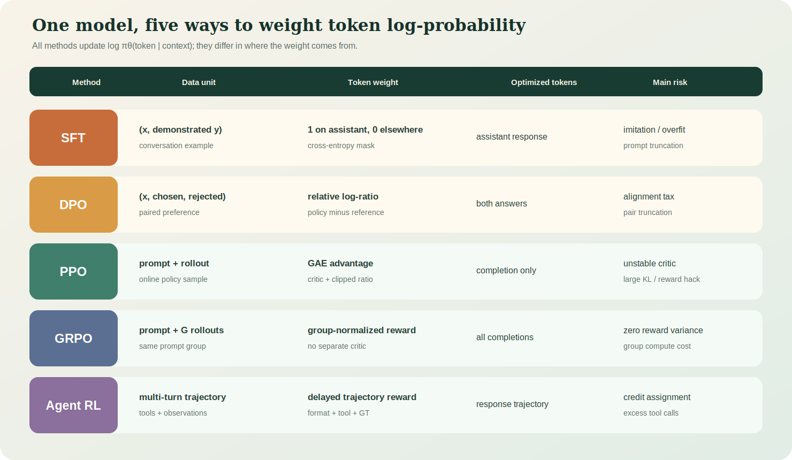

# 从交叉熵到 Agent RL：LifeOS-Agent 数学推导详解

> 本文面向希望真正理解训练原理的工程学习者。它不要求先掌握强化学习，但默认读者理解基本的概率、导数、向量和矩阵。
>
> 阅读目标：能够从一条 JSONL 样本出发，写出对应张量、目标函数、梯度方向，并解释训练日志中的 loss、reward、KL 和 advantage。

## 0. 符号与整体目标



统一符号：

| 符号 | 含义 |
|---|---|
| $B$ | batch size |
| $T$ | 输入序列 token 数 |
| $P$ | prompt token 数 |
| $R$ | completion token 数 |
| $V$ | vocabulary size |
| $D$ | hidden size，本项目为 768 |
| $H$ | attention head 数 |
| $d_h=D/H$ | 单个 attention head 的维度 |
| $x$ | prompt、状态或上下文 |
| $y=(y_1,\ldots,y_R)$ | assistant 回答或动作序列 |
| $\pi_\theta(y\mid x)$ | 参数为 $\theta$ 的当前策略 |
| $\pi_{ref}$ | reference policy |
| $r(x,y)$ | 回答或轨迹的 reward |
| $A_t$ | 第 $t$ 个动作的 advantage |

语言模型和 Agent 的统一视角是：给定状态 $s_t$，模型选择下一个 token $a_t$。

$$
\pi_\theta(a_t\mid s_t)=p_\theta(x_{t+1}=a_t\mid x_{\le t})
$$

一段回答的联合概率由链式法则得到：

$$
\pi_\theta(y\mid x)
=\prod_{t=1}^{R}\pi_\theta(y_t\mid x,y_{<t})
$$

取对数后，乘法变为求和：

$$
\log\pi_\theta(y\mid x)
=\sum_{t=1}^{R}\log\pi_\theta(y_t\mid x,y_{<t})
$$

这条式子贯穿 SFT、DPO、PPO、GRPO 和 Agent RL。它们的核心差异不是模型结构，而是“如何给每个 token 的 log probability 加权”。

## 1. 从 logits 到概率

Transformer 对每个位置输出一个长度为 $V$ 的 logits 向量：

$$
z_t=(z_{t,1},\ldots,z_{t,V})\in\mathbb R^V
$$

logits 不是概率，可以为任意实数。通过 softmax 得到分类分布：

$$
p_{t,k}=\frac{e^{z_{t,k}}}{\sum_{j=1}^{V}e^{z_{t,j}}}
$$

为了数值稳定，工程实现会先减去最大 logit：

$$
p_{t,k}=\frac{e^{z_{t,k}-m}}{\sum_j e^{z_{t,j}-m}},
\quad m=\max_jz_{t,j}
$$

分子和分母同乘 $e^{-m}$，概率不变，但避免 $e^{z}$ 溢出。

### 1.1 Log-softmax

训练通常直接计算 log probability：

$$
\log p_{t,k}=z_{t,k}-\log\sum_j e^{z_{t,j}}
$$

代码：

```python
log_probs = F.log_softmax(logits, dim=-1)       # [B, T, V]
target_logp = torch.gather(
    log_probs,
    dim=-1,
    index=labels.unsqueeze(-1),
).squeeze(-1)                                   # [B, T]
```

`gather` 的含义是：每个位置只取真实 target token 对应的 log probability。

## 2. 交叉熵的完整推导

假设真实 token 的 one-hot 分布为 $q$，模型分布为 $p$：

$$
q_k=\begin{cases}
1,&k=y\\
0,&k\ne y
\end{cases}
$$

交叉熵定义：

$$
H(q,p)=-\sum_{k=1}^{V}q_k\log p_k
$$

由于 $q$ 只有真实类别为 1：

$$
H(q,p)=-\log p_y
$$

对一个 batch 的有效 token 求平均：

$$
\mathcal L_{CE}
=-\frac{1}{N}\sum_{b,t:m_{b,t}=1}
\log p_\theta(y_{b,t}\mid x_{b,<t})
$$

$m_{b,t}$ 是 loss mask。PyTorch 中常用 `labels=-100` 表示 $m=0$。

### 2.1 为什么梯度是 $p-q$

单位置 loss：

$$
L=-\log p_y=-z_y+\log\sum_j e^{z_j}
$$

对第 $k$ 个 logit 求导：

$$
\frac{\partial L}{\partial z_k}
=-\mathbf 1[k=y]+\frac{e^{z_k}}{\sum_j e^{z_j}}
=p_k-q_k
$$

因此：

- 对正确 token：梯度为 $p_y-1<0$，梯度下降会提高 $z_y$；
- 对错误 token：梯度为 $p_k>0$，梯度下降会降低 $z_k$；
- 模型越确信正确答案，$p_y\to1$，梯度越小。

这解释了为什么已经记住的“助手名字”样本很快 loss 接近 0，也解释了机械重复身份样本为什么很容易过拟合。

## 3. Causal LM 的 shift

输入序列：

```text
[BOS, 我, 是, LifeOS, EOS]
```

训练配对：

```text
输入 x: [BOS, 我, 是, LifeOS]
目标 y: [我, 是, LifeOS, EOS]
```

即：

$$
x_{b,t}\longrightarrow y_{b,t}=x_{b,t+1}
$$

张量：

```text
input_ids                 [B, T]
logits                    [B, T, V]
shift_logits              [B, T-1, V]
shift_labels              [B, T-1]
loss                      scalar
```

模型在位置 $t$ 的输出只能利用 $x_{\le t}$，因为 causal mask 把未来 attention score 设为 $-\infty$。

## 4. Attention 的矩阵推导

输入隐藏状态：

$$
X\in\mathbb R^{B\times T\times D}
$$

线性投影：

$$
Q=XW_Q,\quad K=XW_K,\quad V=XW_V
$$

拆分多头后：

```text
Q, K, V                  [B, H, T, d_h]
K transpose              [B, H, d_h, T]
QK^T                     [B, H, T, T]
attention weights        [B, H, T, T]
weighted values          [B, H, T, d_h]
concat heads             [B, T, D]
```

第 $i$ 个 token 对第 $j$ 个 token 的相似度：

$$
s_{ij}=q_i^Tk_j
$$

若 $q,k$ 每一维方差约为 1，点积方差约为 $d_h$。维度越大，softmax 输入越极端，因此除以 $\sqrt{d_h}$：

$$
\operatorname{Var}\left(\frac{q^Tk}{\sqrt{d_h}}\right)\approx1
$$

最终：

$$
\operatorname{Attention}(Q,K,V)
=\operatorname{softmax}\left(\frac{QK^T}{\sqrt{d_h}}+M\right)V
$$

其中：

$$
M_{ij}=\begin{cases}
0,&j\le i\\
-\infty,&j>i
\end{cases}
$$

## 5. Pretrain 与 SFT 的差异

两者都使用交叉熵，区别是 mask。

### 5.1 Pretrain mask

$$
m_t=\mathbf1[x_t\ne PAD]
$$

除 padding 外，所有 token 都监督。

### 5.2 SFT mask

$$
m_t=\mathbf1[t\text{ 位于 assistant 消息中}]
$$

system、user、tool response 是条件，不作为目标；assistant 的 `<tool_call>` 和最终回答参与 loss。

```text
system tokens          mask=0
user tokens            mask=0
assistant tool_call    mask=1
tool result            mask=0
assistant final        mask=1
padding                mask=0
```

SFT 目标：

$$
\mathcal L_{SFT}
=-\frac{\sum_{b,t}m_{b,t}\log\pi_\theta(y_{b,t}|s_{b,t})}
{\sum_{b,t}m_{b,t}}
$$

### 5.3 有效 token 比例

定义：

$$
\rho=\frac{\sum m_{b,t}}{BT}
$$

当对话 prompt 很长而 assistant 很短时，$\rho$ 很小。同样 batch size 下，有效梯度 token 更少。比较训练速度时，应该看 tokens/sec 和 supervised tokens/sec，而不仅是 samples/sec。

## 6. 从最大似然到偏好学习

SFT 告诉模型“模仿这个答案”，但不能直接表达“答案 A 比答案 B 好”。偏好数据为：

$$
(x,y^+,y^-)
$$

Bradley-Terry 模型假设：

$$
P(y^+\succ y^-|x)
=\sigma(r(x,y^+)-r(x,y^-))
$$

其中：

$$
\sigma(z)=\frac{1}{1+e^{-z}}
$$

如果 $r^+-r^-$ 很大，chosen 被偏好的概率接近 1。

## 7. DPO 从 KL 约束 RL 的推导

考虑优化：

$$
\max_\pi\ \mathbb E_{y\sim\pi(y|x)}[r(x,y)]
-\beta D_{KL}(\pi(y|x)\|\pi_{ref}(y|x))
$$

KL：

$$
D_{KL}(\pi\|\pi_{ref})
=\sum_y\pi(y|x)\log\frac{\pi(y|x)}{\pi_{ref}(y|x)}
$$

加入归一化约束 $\sum_y\pi(y|x)=1$，拉格朗日函数：

$$
\mathcal J(\pi)=
\sum_y\pi(y|x)r(x,y)
-\beta\sum_y\pi(y|x)\log\frac{\pi(y|x)}{\pi_{ref}(y|x)}
+\lambda\left(\sum_y\pi(y|x)-1\right)
$$

对 $\pi(y|x)$ 求偏导并令其为 0：

$$
r(x,y)-\beta\left(\log\frac{\pi(y|x)}{\pi_{ref}(y|x)}+1\right)+\lambda=0
$$

整理：

$$
r(x,y)=\beta\log\frac{\pi(y|x)}{\pi_{ref}(y|x)}+C(x)
$$

$C(x)$ 对同一 prompt 的两个回答相减时消失：

$$
r^+-r^-
=\beta\left[
\log\frac{\pi(y^+|x)}{\pi_{ref}(y^+|x)}
-\log\frac{\pi(y^-|x)}{\pi_{ref}(y^-|x)}
\right]
$$

代入 Bradley-Terry likelihood：

$$
\mathcal L_{DPO}
=-\log\sigma\left(\beta\left[
\log\frac{\pi_\theta(y^+|x)}{\pi_{ref}(y^+|x)}
-\log\frac{\pi_\theta(y^-|x)}{\pi_{ref}(y^-|x)}
\right]\right)
$$

### 7.1 DPO 梯度方向

令：

$$
u=\beta[(\log\pi_\theta^+-\log\pi_\theta^-)
-(\log\pi_{ref}^+-\log\pi_{ref}^-)]
$$

$$
L=-\log\sigma(u)
$$

则：

$$
\frac{dL}{du}=\sigma(u)-1=-\sigma(-u)
$$

当 policy 还没有正确偏好 chosen 时，$u$ 小，$\sigma(-u)$ 大，更新较强；当 chosen 优势已经很大，梯度趋近 0。

### 7.2 $\beta$ 的含义

- $\beta$ 大：对偏好差更敏感，同时隐含更强 reference 约束尺度；
- $\beta$ 小：log-ratio 差需要更大才能得到同样分类置信度；
- 不同 $\beta$ 下的 DPO loss 不能直接横比。

## 8. Policy Gradient 的来源

强化学习目标：

$$
J(\theta)=\mathbb E_{\tau\sim\pi_\theta}[R(\tau)]
$$

使用 log-derivative trick：

$$
\nabla_\theta p_\theta(\tau)
=p_\theta(\tau)\nabla_\theta\log p_\theta(\tau)
$$

因此：

$$
\nabla_\theta J
=\mathbb E_{\tau\sim\pi_\theta}
[R(\tau)\nabla_\theta\log p_\theta(\tau)]
$$

一条轨迹的 log probability 是动作 log probability 之和：

$$
\log p_\theta(\tau)=\sum_t\log\pi_\theta(a_t|s_t)
$$

于是：

$$
\nabla_\theta J
=\mathbb E\left[\sum_tR(\tau)\nabla_\theta\log\pi_\theta(a_t|s_t)\right]
$$

这说明高 reward 轨迹中的 token 概率应提高，低 reward 轨迹中的 token 概率应降低。

## 9. Baseline、Value 与 Advantage

直接使用 $R$ 方差很大。减去与动作无关的 baseline 不改变期望梯度：

$$
\mathbb E[b(s)\nabla\log\pi(a|s)]=0
$$

选择：

$$
b(s)=V^\pi(s)=\mathbb E[R|s]
$$

advantage：

$$
A^\pi(s,a)=Q^\pi(s,a)-V^\pi(s)
$$

直觉：reward 高并不一定说明动作好；如果这个状态本来就容易，必须与“该状态下通常能获得多少 reward”比较。

## 10. TD Error 与 GAE 推导

一步 TD error：

$$
\delta_t=r_t+\gamma V(s_{t+1})-V(s_t)
$$

$k$ 步 advantage 可以由 TD error 展开。GAE 对不同步数加指数权重：

$$
A_t^{GAE(\gamma,\lambda)}
=\sum_{l=0}^{\infty}(\gamma\lambda)^l\delta_{t+l}
$$

递推形式：

$$
A_t=\delta_t+\gamma\lambda A_{t+1}
$$

代码从后向前计算：

```python
last_gae = 0
for t in reversed(range(R)):
    delta = reward[t] + gamma * next_value - value[t]
    last_gae = delta + gamma * lam * last_gae
    advantages[t] = last_gae
returns = advantages + old_values
```

- $\lambda=0$：接近一步 TD，偏差较大、方差较小；
- $\lambda\to1$：接近 Monte Carlo return，偏差较小、方差较大。

## 11. Importance Sampling 与 PPO

rollout 由旧策略 $\pi_{old}$ 采样，但更新的是新策略 $\pi_\theta$。使用 importance ratio：

$$
r_t(\theta)=\frac{\pi_\theta(a_t|s_t)}{\pi_{old}(a_t|s_t)}
=\exp(\log\pi_\theta-\log\pi_{old})
$$

未裁剪目标：

$$
L^{PG}=\mathbb E[r_t(\theta)A_t]
$$

如果 $r$ 可以任意变化，单个 batch 会让策略更新过猛。PPO 使用：

$$
L^{CLIP}=\mathbb E\left[
\min(r_tA_t,\operatorname{clip}(r_t,1-\epsilon,1+\epsilon)A_t)
\right]
$$

训练代码最小化负目标：

$$
\mathcal L_{policy}=-L^{CLIP}+\beta_{KL}D_{KL}(\pi_\theta\|\pi_{ref})
$$

### 11.1 为什么正负 advantage 要分开理解

当 $A>0$，希望增大动作概率，但 $r>1+\epsilon$ 后不再奖励继续增大。

当 $A<0$，希望降低动作概率，但 $r<1-\epsilon$ 后不再奖励继续降低。

clip 不是把所有 ratio 都裁剪后直接乘 advantage，而是取两个 surrogate 中更保守的一个。

### 11.2 ClipFrac

$$
\text{ClipFrac}=\frac{1}{N}\sum_t
\mathbf1[|r_t-1|>\epsilon]
$$

- 持续接近 0：更新可能很小，或每个 rollout 后立即更新；
- 过高：策略变化太快；
- 必须结合 learning rate、KL 和 reward 判断。

## 12. PPO Critic 与 Value Clipping

普通 value loss：

$$
L_V=\frac12(V_\theta(s_t)-R_t)^2
$$

为防止 value 一次更新过大：

$$
V_{clip}=\operatorname{clip}
(V_\theta,V_{old}-\epsilon_V,V_{old}+\epsilon_V)
$$

$$
L_V=\frac12\max[(V_\theta-R)^2,(V_{clip}-R)^2]
$$

PPO 总 loss：

$$
\mathcal L
=\mathcal L_{policy}
+c_V\mathcal L_V
+\mathcal L_{aux}
$$

本项目非 MoE 时 $\mathcal L_{aux}=0$。

## 13. KL Divergence 与 Reference Model

离散分布 KL：

$$
D_{KL}(p\|q)=\sum_xp(x)\log\frac{p(x)}{q(x)}\ge0
$$

训练中使用 sample-based estimator。MiniMind 中可见形式：

$$
k=\log\pi_{ref}-\log\pi_\theta
$$

$$
\widehat{KL}=e^k-k-1
$$

因为对任意 $k$，$e^k\ge1+k$，所以该 estimator 非负。

KL 的意义：防止 policy 为迎合 reward model 而远离原语言能力。KL 太大可能出现：

- 文本风格异常；
- 知识能力退化；
- reward hacking；
- 生成固定模板或极端长度。

## 14. Reward 不是 Loss

reward 是环境或模型对完整输出的评价；loss 是用来产生梯度的可微目标。

本项目 PPO reward：

$$
r=r_{RM}+r_{length}+r_{thinking}-r_{repetition}
$$

reward model 本身不对 MiniMind 反向传播，只输出一个标量。该标量通过 advantage 改变 policy log probability 的权重。

如果 reward model 给出 $1.2$，不是说 loss 应等于 $-1.2$；它先进入 GAE/advantage，再经 ratio 和 clipping 形成 policy loss。

## 15. GRPO 的组内优势

对同一个 prompt 采样 $G$ 个回答：

$$
y_1,\ldots,y_G\sim\pi_{old}(\cdot|x)
$$

对应 reward：

$$
r_1,\ldots,r_G
$$

组均值和标准差：

$$
\mu=\frac1G\sum_{i=1}^{G}r_i
$$

$$
\sigma=\sqrt{\frac1G\sum_i(r_i-\mu)^2}
$$

优势：

$$
A_i=\frac{r_i-\mu}{\sigma+\varepsilon}
$$

于是：

$$
\frac1G\sum_iA_i\approx0
$$

GRPO 不需要单独 critic。它回答的是：“对于同一个问题，这条回答比同组平均水平好多少？”

### 15.1 零方差问题

若所有回答 reward 相同：

$$
r_1=\cdots=r_G\Rightarrow\sigma=0,\quad A_i=0
$$

没有相对信号，policy 几乎不更新。因此监控 group reward std 比只看平均 reward 更重要。

### 15.2 GRPO Loss

$$
\mathcal L_{GRPO}
=-\frac1G\sum_i\frac1{R_i}\sum_t m_{i,t}
\left[
\min(r_{i,t}A_i,\operatorname{clip}(r_{i,t},1-\epsilon,1+\epsilon)A_i)
-\beta KL_{i,t}
\right]
$$

prompt token 的 completion mask 为 0，只有生成 token 更新。

## 16. CISPO 与 GRPO 的区别

MiniMind 默认 `loss_type=cispo`。其形式可概括为：

$$
\mathcal L_{CISPO}
=-\operatorname{clip}(r,0,\epsilon_{high})_{stopgrad}
\cdot A\cdot\log\pi_\theta
+\beta KL
$$

关键是 clipped ratio 被 detach，但 $\log\pi_\theta$ 保留梯度。即使 ratio 被截断，梯度路径仍通过 log probability 存在；这与 PPO/GRPO 直接对 surrogate 取 min 的梯度行为不同。

## 17. Agent RL：从单轮回答到轨迹

Agent 状态包括完整消息历史：

$$
s_t=(system,user,tools,tool\ calls,tool\ results,\ldots)
$$

动作不只是自然语言，也可能是：

```xml
<tool_call>{"name":"calculate_math","arguments":{...}}</tool_call>
```

环境执行工具后返回 observation：

$$
o_{t+1}=\operatorname{execute\_tool}(a_t)
$$

新状态：

$$
s_{t+1}=s_t\oplus a_t\oplus o_{t+1}
$$

整条 episode：

$$
\tau=(s_0,a_0,o_1,s_1,a_1,\ldots,a_T)
$$

最终 reward：

$$
R(\tau)=
w_1r_{format}+w_2r_{tool}+w_3r_{args}
+w_4r_{gt}-w_5r_{unfinished}-w_6r_{repeat}
$$

### 17.1 延迟奖励与信用分配

如果最终答案正确，前面的工具选择和参数也应获得正向信用。但只给整条轨迹一个标量会产生信用分配困难：无法直接知道哪一步最关键。

当前实现把轨迹 reward 作为同一 completion 的 advantage 权重，属于 trajectory-level credit。更精细的方法可以对每次工具执行给 step reward：

$$
R_t=r_{tool\ valid}+r_{execution}+r_{observation}
$$

但 step reward 设计错误也会导致模型为了刷分而过度调用工具。

## 18. Tool Calling Reward 的数学设计

可解释 reward：

$$
r_{total}=
0.20r_{format}
+0.20r_{name}
+0.20r_{args}
+0.15r_{execution}
+0.20r_{grounded}
+0.05r_{efficiency}
$$

建议各项定义：

$$
r_{format}=\mathbf1[XML\ closed\land JSON\ valid]
$$

$$
r_{name}=\mathbf1[name\in candidate\ tools]
$$

$$
r_{args}=\mathbf1[arguments\ satisfy\ schema]
$$

$$
r_{execution}=\mathbf1[tool\ returns\ no\ error]
$$

$$
r_{grounded}=\frac{|GT\cap answer|}{|GT|}
$$

$$
r_{efficiency}=1-\frac{\max(0,n_{calls}-n_{needed})}{n_{max}}
$$

必须加入无工具负样本，否则：

$$
\text{只奖励合法 tool call}\Rightarrow
\text{所有问题都调用工具}
$$

这是典型 reward hacking。

## 19. 截断为什么会改变 Loss

设回答 token 为 $y_1,\ldots,y_R$，上限只保留前 $K<R$：

$$
\mathcal L_{truncated}
=-\sum_{t=1}^{K}\log p(y_t|x,y_{<t})
$$

尾部目标完全不产生梯度。如果最终答案、工具结果或 `<tool_call>` 闭合标签位于尾部，模型可能只学到“开始调用”，却学不到“正确闭合和回答”。

本文数据分析发现：

- DPO 内容 token 估计超限率约 14.68%；
- Agent RL 约 22.05%；
- chat template 和 tools schema 会进一步增加长度。

因此不能只提高 epoch；先处理截断通常比多训一轮更重要。

## 20. Batch、梯度累积与有效 batch

显存只能容纳 micro batch $B_m$，累积 $K$ 次后更新：

$$
B_{effective}=B_m\times K\times N_{GPU}
$$

每一步先除以 accumulation steps：

$$
L'=\frac{L}{K}
$$

累积梯度：

$$
g=\sum_{k=1}^{K}\nabla_\theta L'_k
=\frac1K\sum_{k=1}^{K}\nabla_\theta L_k
$$

等价于对 $K$ 个 micro batch 的梯度求平均。

## 21. Learning Rate 与训练轮数

参数更新：

$$
\theta_{t+1}=\theta_t-\eta_t\hat g_t
$$

总更新量不仅由 epoch 决定：

$$
\Delta\theta\approx-\sum_t\eta_t\hat g_t
$$

因此“需要几个 epoch”必须同时考虑：

- 数据量与重复率；
- learning rate；
- 有效 batch；
- 有效监督 token；
- 是否从已对齐 checkpoint 开始；
- 目标行为复杂度。

身份名字只需少量数据，因为输出模式短且熵低；Agent 工具泛化需要更多场景，因为要联合学习工具选择、参数、结果利用和停止条件。

## 22. 为什么名字微调容易立即生效

若训练样本目标固定为“我是 LifeOS-Agent”，正确 token 序列几乎不变。重复 $n$ 次后，梯度持续提高同一组 token 的 logits：

$$
\Delta z_{name}\propto
\sum_{i=1}^{n}(1-p_{name}^{(i)})
$$

随着 $p_{name}\to1$，梯度变小，但 greedy decoding 已会稳定选择该名字。

本项目还在 system prompt 和 fallback 中硬编码身份，因此观察到的即时效果并不能全部归因于模型权重。

## 23. 训练日志应该怎么读

### SFT

关注：

```text
train CE
validation CE
supervised token ratio
truncation rate
tool-call exact match
```

### DPO

关注：

```text
DPO loss
chosen reward margin
rejected reward margin
policy-reference KL
普通能力回归
```

### PPO

关注：

```text
reward mean/std
KL_ref
Approx KL
ClipFrac
critic loss
response length
repetition rate
```

### GRPO

关注：

```text
reward mean
group reward std
advantage std
policy loss
KL
response length
```

### Agent RL

关注：

```text
tool selection accuracy
valid JSON rate
argument schema pass rate
execution success rate
GT hit rate
unfinished trajectory rate
average tool calls
final answer grounded rate
```

## 24. 常见误区的数学解释

### 误区一：Loss 越小，所有能力越强

错误。不同目标函数尺度不同：

$$
L_{SFT}\not\sim L_{DPO}\not\sim L_{PPO}
$$

只能在相同数据、mask、超参数和目标函数下比较趋势。

### 误区二：Reward 上升就可以部署

reward model 只是代理目标：

$$
r_{proxy}(y)\ne r_{human}(y)
$$

模型可能利用代理模型漏洞提高 reward，同时降低真实质量。

### 误区三：多训练几个 epoch 可以解决数据问题

如果样本标签错误，重复训练只会放大错误梯度：

$$
\sum_{epoch}\nabla L_{wrong}
$$

### 误区四：Tool result 会自动成为训练目标

在 SFT mask 中 tool role 通常为条件，mask=0。真正监督的是模型如何根据 tool result 生成后续 assistant token。

## 25. 一张统一公式表

| 方法 | 核心目标 |
|---|---|
| Pretrain | $-\sum_{all\ nonpad}\log p(y_t|x_{<t})$ |
| SFT | $-\sum_{assistant}\log p(y_t|x_{<t})$ |
| DPO | $-\log\sigma(\beta[\Delta\log\pi_\theta-\Delta\log\pi_{ref}])$ |
| PPO | $-\min(rA,clip(r)A)+\beta KL+c_VL_V$ |
| GRPO | group-normalized $A_i$ + clipped policy loss + KL |
| CISPO | detached clipped ratio $\times A\times\log\pi$ + KL |
| Agent RL | GRPO/CISPO over multi-turn tool trajectories |

## 26. 掌握检查题

读完后应能独立回答：

1. 为什么 SFT 的 user token 不参与 loss，却仍影响梯度？
2. 为什么 DPO 需要 reference model？
3. DPO 中 chosen/rejected 为什么必须来自同一 prompt？
4. PPO 为什么不能直接用当前 policy 重算旧 rollout 而忽略 importance ratio？
5. GAE 的 $\lambda$ 如何控制 bias-variance tradeoff？
6. PPO 的 ClipFrac 高意味着什么？
7. GRPO 为什么不需要 critic？
8. 同组 reward 全相等时为什么没有有效梯度？
9. Agent 最终 reward 如何给早期工具调用分配信用？
10. 为什么工具 schema 太长会减少有效 assistant token？
11. 为什么名字微调不能证明模型真正学会了角色？
12. 为什么不同训练阶段的 loss 数值不能横向比较？

## 27. 与项目文件对应

| 数学主题 | 代码/文档 |
|---|---|
| SFT mask | `vendor/minimind-master/dataset/lm_dataset.py` 的 `SFTDataset.generate_labels` |
| DPO log-ratio | `vendor/minimind-master/trainer/train_dpo.py` |
| PPO GAE/clip/value | `vendor/minimind-master/trainer/train_ppo.py` |
| GRPO group advantage | `vendor/minimind-master/trainer/train_grpo.py` |
| Agent trajectory reward | `vendor/minimind-master/trainer/train_agent.py` |
| Tool runtime | `lifeos_agent/main.py`、`tools.py`、`router.py` |
| 数据统计与训练全链路 | `docs/TRAINING_METHODS_COMPLETE_GUIDE.md` |
| 项目结果 | `FINAL_PROJECT_REPORT.md` |

## 28. 最终认知框架

可以把所有阶段压缩成一句话：

```text
Pretrain 学语言分布；
SFT 学示范行为；
DPO 学成对偏好；
PPO 用 critic 估计 advantage；
GRPO 用同组回答估计 advantage；
Agent RL 把同样的策略优化扩展到多轮工具轨迹。
```

它们最终都通过同一个底层动作起作用：调整模型输出 token 的 log probability。真正的区别是每个 token 获得什么权重、这个权重来自标签、偏好、value、组内比较，还是完整环境轨迹的 reward。
