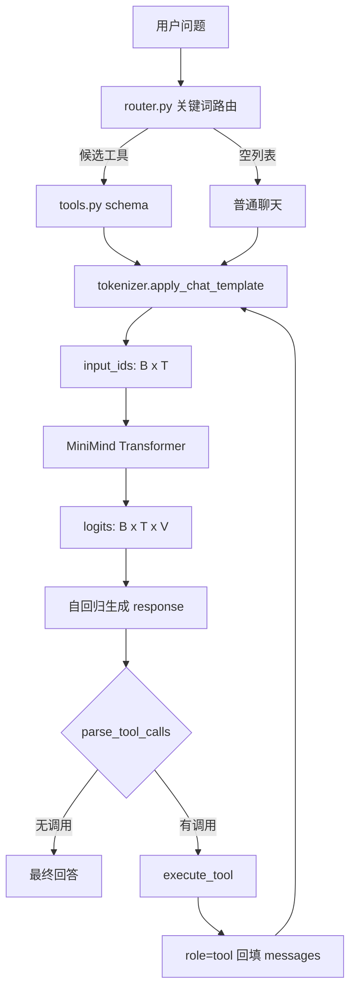
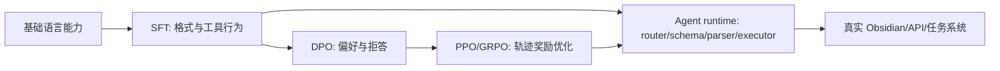

# LifeOS-Agent 训练与 Agent 全流程教程

> 目标：从 MiniMind 的 token、Transformer、SFT 到 DPO/PPO/GRPO，再到 Tool Calling Agent，完整掌握一次请求如何流经数据、模型、工具和最终回答。
> 本文对应仓库：`LifeOS-Agent`。公式使用 Markdown LaTeX；流程图使用 Mermaid。

## 0. 先看全局地图



本项目的 Agent 不是“模型自己执行函数”。模型只生成结构化文本；真正执行工具的是外部 Python 循环。这个边界决定了安全性、可测试性和可观测性。

## 1. 输入到 Transformer 的维度

设 batch size 为 $B$，输入 token 数为 $T$，词表大小为 $V$，隐藏维度为 $D$，层数为 $L$。

### 1.1 Tokenizer

```python
input_text = tokenizer.apply_chat_template(
    messages,
    tools=tools,
    tokenize=False,
    add_generation_prompt=True,
    open_thinking=False,
)
inputs = tokenizer(input_text, return_tensors="pt")
```

维度变化：

```text
messages                : Python list[dict]
input_text              : str，包含 system/user/tools/template
input_ids               : [B, T]
attention_mask          : [B, T]
```

`tools=tools` 不代表把 Python 函数传给模型，而是让 tokenizer 把函数名、描述、参数 JSON Schema 渲染进 system/template 文本。例如 `calculate_math` 的 schema 会让模型看到 `expression: string`。

### 1.2 MiniMind Decoder-only

单层核心张量可以抽象为：

```text
embedding output         [B, T, D]
Q, K, V                  [B, H, T, d_head]
attention scores         [B, H, T, T]
attention output         [B, T, D]
FFN output               [B, T, D]
final hidden states      [B, T, D]
lm_head logits           [B, T, V]
```

其中 $D=H\times d_{head}$。因果 mask 保证第 $t$ 个位置不能读取未来位置：

$$
\text{Attention}(Q,K,V)=\text{softmax}\left(\frac{QK^T}{\sqrt{d_{head}}}+M\right)V
$$

训练时最后一个维度 $V$ 是每个位置对下一个 token 的分类分布。推理时通常只取最后一个位置的 logits：

$$
p(x_{t+1}|x_{\leq t})=\text{softmax}(z_t)
$$

本项目 MiniMind 配置常用 $D=768,L=8$，参数量约 63.9M；实际输入长度 $T$ 会随 tools schema、历史消息和 tool result 变化。

## 2. Tool Calling 的完整中间态

以 `17.66 涨停价是多少？` 为例：

```text
1. user_input                         str
2. candidate_tool_names               ["calculate_math"]
3. tools                              1 个 function schema
4. messages                           2 条：system + user
5. input_text                         schema 被 chat template 渲染后的字符串
6. input_ids                          [1, T]
7. model output                       <tool_call>{...}</tool_call>
8. parse_tool_calls                   [{name, arguments}]
9. execute_tool                       {"result": 19.43}
10. messages                          增加 assistant + role=tool，共 4 条
11. 第二轮 input_ids                  [1, T2]
12. final answer                      自然语言回答
```

模型输出的结构：

```xml
<tool_call>
{"name": "calculate_math", "arguments": {"expression": "round(17.66 * 1.1, 2)"}}
</tool_call>
```

外部执行：

```python
tool_calls = parse_tool_calls(response)
result = execute_tool(tool_call["name"], tool_call["arguments"])
messages.append({
    "role": "tool",
    "content": json.dumps(result, ensure_ascii=False),
})
```

`role=tool` 是第二轮的事实来源。没有它，模型只能重复自己刚才生成的参数，不能知道外部计算结果。

运行教学模式：

```bash
python lifeos_agent/main.py \
  --minimind_repo /home/caius/minimind \
  --tokenizer_path /home/caius/minimind/model \
  --checkpoint_path /home/caius/minimind/out/lifeos_agent_v4_768.pth \
  --prompt "17.66 涨停价是多少？"
```

你会看到：`messages=2`、`schema_tools=1`、`input_ids.shape=(1,T)`、解析调用、tool result 字符数、回填后的 `messages=4`，以及第二轮新的 token shape。

## 3. SFT：让模型学会格式和行为

### 3.1 监督目标

SFT 数据是一组 $(x,y)$，其中 $x$ 是 prompt/history，$y$ 是 assistant 目标序列。自回归交叉熵为：

$$
\mathcal{L}_{SFT}=-\sum_{t=1}^{T}\log p_\theta(y_t|x,y_{<t})
$$

在 MiniMind 的实现里，通常用 `labels` 对齐 `input_ids`，并通过 shift 让位置 $t$ 预测 $t+1$：

```python
logits = model(input_ids, labels=labels).logits
# logits: [B, T, V]
# labels: [B, T]
# loss:   scalar，对有效 label 的 token 平均交叉熵
```

Tool Calling 样本的监督重点不是只学习最终答案，而是学习：

```text
给定 tools schema
-> 输出正确 tool name
-> 输出合法 JSON arguments
-> 等待 role=tool
-> 根据 tool result 生成最终回答
```

### 3.2 本项目混合数据

`build_lifeos_sft_mix.py` 做三件事：

1. 读取官方 SFT 样本。
2. 读取 `lifeos_sft_seed.jsonl`，重复或混合以提高早期实验中的行为信号。
3. 从 `tool_calls` 提取工具名，只把相关 tools schema 注入 system message。

数据维度可以这样理解：

```text
JSONL rows                  N 条样本
每条 conversations          M_i 条消息
chat template 后            T_i tokens
batch                        [B, max(T_i)]
labels                       [B, max(T_i)]，padding 位置为 ignore_index
```

### 3.3 SFT 常见问题

- seed 重复过多：模型记住固定答案，导致任务重复或泛化下降。
- 只有 tool call 没有 tool result：模型学不会第二轮回答。
- tools schema 全量注入：模型更容易误选工具，prompt 也更长。
- 没有普通聊天样本：模型可能逢问必调工具。
- 没有独立评测集：训练 loss 下降不能证明 Agent 变好。

## 4. DPO：不训练 reward model 的偏好优化

DPO 数据是 $(x,y^+,y^-)$：同一个 prompt 下，一个回答更好，一个回答更差。参考模型为 $\pi_{ref}$，当前策略为 $\pi_\theta$。

经典 DPO 目标：

$$
\mathcal{L}_{DPO}=-\log\sigma\left(\beta\left[
\log\frac{\pi_\theta(y^+|x)}{\pi_{ref}(y^+|x)}-
\log\frac{\pi_\theta(y^-|x)}{\pi_{ref}(y^-|x)}
\right]\right)
$$

直觉：提高 chosen 相对 reference 的概率，同时降低 rejected 的相对优势。

LifeOS 的 DPO 样本可以这样构造：

```json
{
  "prompt": "17.66 涨停价是多少？",
  "chosen": "先调用 calculate_math，得到 19.43 后回答。",
  "rejected": "直接猜一个价格，不调用工具。"
}
```

DPO 适合修正：

- 工具已调用但最终回答重复。
- 参数合法但解释不清晰。
- 普通聊天误调用工具。
- 多个候选工具中选择了错误工具。

DPO 不适合替代基础 SFT。模型连 `<tool_call>` 格式都不会时，先补 SFT。

## 5. PPO：带价值模型和 rollout 的在线强化学习

PPO 通常需要 policy、reference policy、value model/critic 和 reward。对一条轨迹 $\tau$，优势估计可以写成：

$$
A_t=\sum_{l=0}^{\infty}(\gamma\lambda)^l\delta_{t+l},\quad
\delta_t=r_t+\gamma V(s_{t+1})-V(s_t)
$$

PPO clipped objective：

$$
L^{CLIP}=\mathbb{E}_t\left[\min(r_t(\theta)A_t,
\text{clip}(r_t(\theta),1-\epsilon,1+\epsilon)A_t)\right]
$$

其中：

$$
r_t(\theta)=\frac{\pi_\theta(a_t|s_t)}{\pi_{old}(a_t|s_t)}
$$

用于 Agent 时，状态可以是消息历史，动作可以是下一个 token 或一次工具调用，reward 可以由工具名、参数、执行成功和最终答案共同组成。

PPO 的代价较高：需要采样、打分、value 学习、KL 控制和更多显存。对当前 63.9M MiniMind，先用离线 SFT/DPO 建立稳定基线更实际。

## 6. GRPO：用组内相对奖励减少 critic 依赖

GRPO 对同一个 prompt 采样一组 $G$ 个回答，获得奖励 $r_i$，用组均值和标准差做相对优势：

$$
\hat A_i=\frac{r_i-\text{mean}(r_1,\ldots,r_G)}
{\text{std}(r_1,\ldots,r_G)+\epsilon}
$$

它的核心思想是：不一定需要一个单独 value model，也能比较同一问题下哪些轨迹更好。对 Tool Calling，可定义：

```text
reward = 0.30 * tool_name_correct
       + 0.25 * arguments_valid
       + 0.20 * execution_success
       + 0.20 * final_answer_grounded
       + 0.05 * no_unnecessary_tool
```

GRPO 的风险是 reward 设计错误会被模型钻空子。例如只奖励出现 `<tool_call>`，模型可能对所有问题都调用工具。因此必须同时奖励“普通问题不调用工具”和“最终答案引用 tool result”。

## 7. Agent 训练的层次



Agent 有两个部分：

1. 模型策略：决定是否调用、调用哪个工具、传什么参数、如何回答。
2. Runtime：提供 schema、执行工具、校验结果、控制循环和安全边界。

训练不能替代 runtime 的校验；runtime 也不能弥补完全不会生成结构化调用的模型。两者必须分别测试。

## 8. 维度与测试清单

每一条验收至少记录：

```text
user chars
candidate tools count
schema tools count
messages count before generation
input_ids.shape = [1, T]
generated_ids.shape = [1, T + R]
response token count = R
parsed tool calls count
tool result JSON chars
messages count after role=tool append
final answer
```

四条最小回归：

```bash
python lifeos_agent/main.py --prompt "我之前学 SFTDataset 学到哪了？"
python lifeos_agent/main.py --prompt "我今天应该做什么？"
python lifeos_agent/main.py --prompt "17.66 涨停价是多少？"
python lifeos_agent/main.py --prompt "你好，简单介绍一下你自己"
```

判断标准：

- 知识问题：只出现 `search_fake_obsidian`。
- 任务问题：只出现 `list_today_tasks`。
- 计算问题：只出现 `calculate_math`，结果约 19.43。
- 普通聊天：`Selected tools: []`，prompt 不包含 tools schema。
- 任何工具调用：必须能看到 parse、execute、`role=tool` 回填和第二轮生成。

## 9. 分阶段学习与实现路线

### 阶段一：读懂现有链路

阅读 `lifeos_agent/main.py`、`tools.py`、`router.py` 和 MiniMind 的 `SFTDataset`。重点掌握消息格式、chat template 和 labels。

### 阶段二：掌握维度

用教学模式跑四条回归，手算 `input_ids [B,T]`、hidden `[B,T,D]`、logits `[B,T,V]`，理解为什么第二轮的 $T_2$ 大于第一轮的 $T_1$。

### 阶段三：掌握 SFT

修改 seed，构造完整的 system/user/assistant/tool 轨迹，运行混合数据构造，观察样本数、token 长度和 loss。

### 阶段四：掌握 DPO

为同一问题制作 chosen/rejected，先离线计算两者的 log probability，再理解 reference ratio 和 beta。

### 阶段五：掌握 PPO/GRPO

先在 toy environment 中训练“是否调用工具”，再扩展到真实工具轨迹。不要一开始用真实 vault 做在线奖励，先保证奖励可解释。

### 阶段六：真实 LifeOS

先接入 Obsidian Markdown 只读搜索，再读取 checkbox 任务，之后才考虑写回、日记总结和自动规划。所有写操作需要用户确认。

## 10. 当前项目结论

LifeOS-Agent v0.1 已完成外部 Tool Calling 闭环，并完成 MiniMind v4 增量 SFT。当前最有价值的下一步不是盲目启动 PPO/GRPO，而是：建立评测集、修复工具结果后的重复回答、接入真实 Markdown 数据、再用 DPO 修正偏好。只有当“工具选择、参数、执行、最终回答”都能量化，进阶强化学习才有可靠的 reward 基础。
