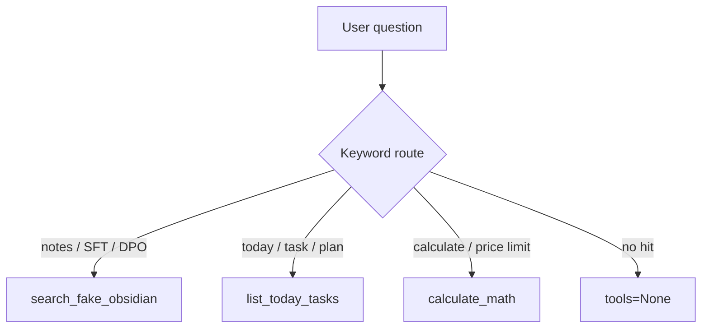
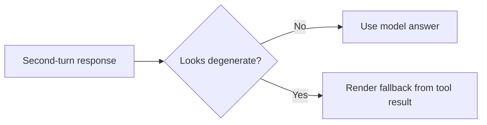

# LifeOS-Agent Architecture

这份文档用图和文字说明 `LifeOS-Agent` 当前的系统结构。它适合用来快速讲清楚：请求从哪里进来、工具怎么进入 prompt、模型怎么发起调用、Python 外部循环怎么回填结果。

## 1. 总览

```mermaid
flowchart LR
    U["User input"] --> R["router.select_tool_names"]
    R --> T["Candidate tools schema"]
    R --> M0["messages: system + user"]
    T --> P["tokenizer.apply_chat_template"]
    M0 --> P
    P --> LLM["MiniMind / lifeos_agent_best_768.pth"]
    LLM --> TC["<tool_call> JSON"]
    TC --> Parser["parse_tool_calls"]
    Parser --> Exec["execute_tool"]
    Exec --> TR["tool result JSON"]
    TR --> Backfill["append role=tool"]
    Backfill --> P2["apply_chat_template again"]
    P2 --> LLM2["MiniMind second turn"]
    LLM2 --> A["Final answer"]
```



核心思想很朴素：模型不直接执行工具，模型只负责“请求工具”。真正的执行发生在 Python 外部程序里。

## 2. 模块职责

| 模块 | 职责 |
| --- | --- |
| `lifeos_agent/main.py` | 主循环：加载模型、构造 prompt、生成、解析 tool call、回填工具结果 |
| `lifeos_agent/router.py` | 根据用户输入选择候选工具，只把相关工具传进 prompt |
| `lifeos_agent/tools.py` | 工具 schema、工具实现、统一执行入口 |
| `lifeos_agent/fake_notes.py` | fake Obsidian 笔记和关键词搜索 |
| `scripts/build_lifeos_sft_mix.py` | 混合官方 SFT 数据和 LifeOS 私有 seed 数据 |
| `scripts/run_remote_lifeos_best.sh` | 本地一键调用远程最佳权重 |
| `scripts/remote_lifeos_selftest.sh` | 批量跑 4 个验收 case |

## 3. Prompt 结构

当命中工具时，`apply_chat_template` 会把工具 schema 注入到 prompt 里：

```xml
<tools>
{"type": "function", "function": {"name": "list_today_tasks", ...}}
</tools>
```

模型应该输出：

```xml
<tool_call>
{"name": "list_today_tasks", "arguments": {}}
</tool_call>
```

然后外部程序把结果回填：

```xml
<tool_response>
{"tasks": ["整理 Tool Calling 笔记", "复习 SFTDataset", "跑通 LifeOS-Agent v0.1"]}
</tool_response>
```

这三个片段是当前训练和推理最关键的“协议层”。

## 4. 为什么要有 Router

Router 的作用不是让 Python 替模型决定最终答案，而是减少模型的选择空间。



这样做有三个好处：

1. 普通聊天不会被工具 schema 干扰
2. 命中工具时只传候选工具，而不是全量工具
3. 小模型更容易稳定输出正确 tool name

## 5. Tool Result 回填

工具执行后，`main.py` 会追加：

```python
messages.append({
    "role": "tool",
    "content": json.dumps(result, ensure_ascii=False),
})
```

MiniMind tokenizer 会把它渲染成 `<tool_response>`。这一步让第二轮模型能“看见”工具执行结果。

## 6. Fallback 兜底

当前 MiniMind 体量很小，第二轮回答偶尔会重复或复读 prompt。为了让 demo 更可用，`main.py` 增加了轻量 fallback：



这个 fallback 不替代训练，只是把明显退化的输出兜住，让当前版本更适合演示和继续开发。

## 7. 当前边界

当前版本已经能证明 Tool Calling 主链路，但还不是完整 LifeOS：

1. `search_fake_obsidian` 仍然是 fake notes
2. `list_today_tasks` 仍然是固定任务
3. 没有真实 Obsidian 扫描
4. 没有向量数据库
5. 没有写入类工具

下一阶段应该先把 fake notes 换成真实 Markdown 检索，而不是直接上复杂 Agentic RL。
