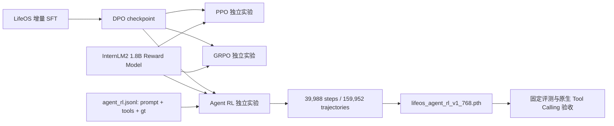
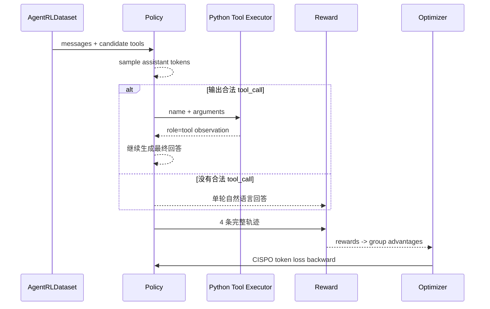

# LifeOS-Agent 远程训练完成报告：从数据到 Agent RL 与最终验收

> 报告日期：2026-07-15（Asia/Shanghai）  
> 训练设备：NVIDIA GeForce RTX 3090 Ti 24 GB  
> 结论：训练流水线完整结束，但最终 Agent RL checkpoint 未通过 LifeOS-Agent v0.1 原生 Tool Calling 验收，暂不应设为默认模型。

## 1. 先看最终结论

这次远程训练不是“还在跑”或“只有脚本”，而是 DPO、PPO、GRPO 和 Agent RL 四个阶段都生成了最终权重。Agent RL 日志到达 `39988/39988`，最后更新时间为 2026-07-15 17:10:14，训练进程已退出，GPU 回到空闲状态，日志中没有 Traceback、OOM、NaN 或 killed 记录。

但是“程序跑完”和“Agent 能正确调用工具”是两个不同验收层次。使用最终 `lifeos_agent_rl_v1_768.pth` 进行四条真实推理后：

- 关键词 router 对三个工具问题都选对了候选 schema；
- 模型没有输出可解析的 JSON `<tool_call>...</tool_call>`；
- 两条输出出现了未闭合 `<tool_call>`；
- 多条输出泄漏了思考文本；
- 数学问题没有调用计算工具，也没有得到 `19.43`；
- 普通自我介绍没有调用工具，但回答质量不合格。

因此当前状态应写成：

| 层次 | 状态 | 证据 |
|---|---|---|
| 数据与训练脚本 | 通过 | 四阶段日志和 checkpoint 均存在 |
| Agent RL 优化循环 | 通过 | 39,988 个 step，159,952 条 rollout 轨迹 |
| 工具外部循环代码 | 通过 | 100 条静态评测中 router/parser/executor 全通过 |
| 最终模型 Tool Calling | **未通过** | 4 条原生推理均未形成合法工具调用闭环 |
| 可部署性 | **未通过** | 不应让 fallback 掩盖模型原生失败 |

## 2. 实际产物与路径

远程 checkpoint：

| 阶段 | 路径 | 大小 | 完成时间 |
|---|---|---:|---|
| LifeOS SFT 最佳版 | `/home/caius/minimind/out/lifeos_agent_best_768.pth` | 132 MiB | 2026-07-11 15:22 |
| DPO | `/home/caius/minimind/out/lifeos_agent_dpo_v1_768.pth` | 132 MiB | 2026-07-11 21:41 |
| PPO | `/home/caius/minimind/out/lifeos_agent_ppo_v1_768.pth` | 132 MiB | 2026-07-12 14:12 |
| GRPO | `/home/caius/minimind/out/lifeos_agent_grpo_v1_768.pth` | 132 MiB | 2026-07-13 02:04 |
| Agent RL | `/home/caius/minimind/out/lifeos_agent_rl_v1_768.pth` | 132 MiB | 2026-07-15 17:10 |

最终 Agent RL checkpoint SHA-256：

```text
85894f385945fc82ee35fb4fa894c5157ccdcadab92a63e933826641d526f948
```

本地分析产物：

- 结构化指标：`analysis/training_log_analysis.json`
- 指标图：`docs/assets/training_metrics.svg`
- 原始日志缓存：`analysis/logs/`，已被 `.gitignore` 排除，不上传 GitHub
- 最终 smoke test：`eval/results/agent_rl_v1_smoke_2026-07-15.json`
- 完整数学教程：`docs/AGENT_RL_COMPLETE_GUIDE.md`
- 五种训练方法对照：`docs/TRAINING_METHODS_COMPLETE_GUIDE.md`

## 3. 完整训练时间线

| 阶段 | 开始 | 结束 | 用时 | step |
|---|---|---|---:|---:|
| DPO | 07-11 21:32:49 | 07-11 21:41:21 | 8 分 32 秒 | 4,292 |
| PPO | 07-12 01:02:05 | 07-12 14:12:44 | 13 小时 10 分 39 秒 | 19,502 |
| GRPO | 07-12 14:12:44 | 07-13 02:04:19 | 11 小时 51 分 34 秒 | 19,502 |
| Agent RL | 07-13 02:04:19 | 07-15 17:10:14 | 63 小时 05 分 55 秒 | 39,988 |

Agent RL 最慢，因为每个 prompt 不是只前向一次，而是生成 4 条轨迹；每条轨迹最多 3 轮，每轮最多生成 256 token，还要执行工具、拼 observation、计算 reward、跑 policy/reference 两套 log probability，最后才反向传播一次。

## 4. 训练流水线



PPO、GRPO 和 Agent RL 都从同一个 DPO checkpoint 分叉，而不是串联继承。这样做便于比较不同 RL 方法，避免把 PPO 的变化混入 GRPO 或 Agent RL。

## 5. 模型与硬件配置

策略模型是 MiniMind dense 版本：

| 参数 | 值 |
|---|---:|
| 参数量 | 63.91M |
| hidden size | 768 |
| Transformer layers | 8 |
| vocabulary size | 6,400 |
| query heads | 8 |
| KV heads | 4 |
| head dimension | 96 |
| dtype | bfloat16 autocast，保存为 fp16 CPU state dict |
| device | CUDA，RTX 3090 Ti 24 GB |
| compile | 关闭 |

训练时另外加载：

- 一份可训练 policy；
- 一份冻结 reference policy；
- 一份 InternLM2 1.8B reward model；
- rollout engine 和生成缓存。

这也是显存和时间远大于普通 SFT 的原因。

## 6. Agent RL 的实际命令配置

```bash
python train_agent.py \
  --data_path /home/caius/projects/LifeOS-Agent/dataset/minimind_dataset/agent_rl.jsonl \
  --hidden_size 768 \
  --num_hidden_layers 8 \
  --max_seq_len 768 \
  --max_gen_len 256 \
  --max_total_len 1600 \
  --batch_size 1 \
  --num_generations 4 \
  --epochs 1 \
  --learning_rate 3e-7 \
  --save_interval 250 \
  --save_dir /home/caius/minimind/out \
  --save_weight lifeos_agent_rl_v1 \
  --from_weight lifeos_agent_dpo_v1 \
  --reward_model_path /home/caius/internlm2-1_8b-reward \
  --device cuda \
  --dtype bfloat16 \
  --num_workers 2 \
  --use_compile 0
```

未显式传入但由代码默认生效的关键参数：

| 参数 | 值 | 作用 |
|---|---:|---|
| `max_turns` | 3 | rollout 内最多三轮生成 |
| `temperature` | 0.8 | 训练 rollout 采样温度 |
| `thinking_ratio` | 0.1 | 约 10% rollout 开启 thinking 模板 |
| `loss_type` | `cispo` | 使用 CISPO 分支计算策略损失 |
| `beta` | 0.1 | KL 惩罚系数 |
| `epsilon_high` | 5.0 | CISPO ratio 上界 |
| `grad_clip` | 1.0 | 梯度裁剪 |
| `accumulation_steps` | 1 | 每 step 更新一次 |
| seed | 42 | 单卡训练随机种子 |

## 7. 一条训练数据怎样进入模型

真实数据的典型结构是：system 消息保存工具 schema，后面可以有历史对话，倒数第二条是当前用户问题，最后一条通常是空 assistant 占位；`gt` 保存希望最终答案出现的结果。

```json
{
  "conversations": [
    {
      "role": "system",
      "content": "",
      "tools": "[{... calculate_math schema ...}]"
    },
    {"role": "user", "content": "...历史问题..."},
    {"role": "assistant", "content": "...历史回答..."},
    {"role": "user", "content": "Compute 2045*6994 for me"},
    {"role": "assistant", "content": ""}
  ],
  "gt": ["14302730"]
}
```

`AgentRLDataset.parse_conversations()` 执行：

```python
return messages[:-1], tools
```

这里的 `[:-1]` 表示保留从第 0 条到倒数第二条，删除最后的空 assistant 占位。于是送入 rollout 的 messages 以最后一个 user 问题结尾，模型再负责生成 assistant 行为。

注意：训练阶段不调用 LifeOS 的关键词 router。每条 `agent_rl.jsonl` 数据已经在 system 消息中携带候选 tools，dataset 将它提取出来，再传给：

```python
tokenizer.apply_chat_template(
    messages,
    tools=tools,
    tokenize=False,
    add_generation_prompt=True,
    open_thinking=open_thinking,
)
```

推理阶段则先由 `lifeos_agent/router.py` 根据用户输入筛选 `search_fake_obsidian`、`list_today_tasks` 或 `calculate_math`，只把候选 schema 放进 prompt。这是训练和 LifeOS 推理的重要差异。

## 8. 多轮工具 rollout

对每个 prompt 生成 `G=4` 条候选轨迹：



每轮模型输出后，训练器用正则寻找：

```text
<tool_call>{"name":"...","arguments":{...}}</tool_call>
```

解析成功才会调用 Python 的 mock tool。工具结果追加为：

```python
messages.append({"role": "tool", "content": result_json})
```

然后重新运行 chat template，生成下一轮。工具 observation token 被拼入上下文，但 `response_mask=0`，不参与策略 loss；模型自己生成的 tool call 和最终答案 token 的 mask 为 1，会参与 loss。

## 9. 张量维度

本次 `B=1`、`G=4`。动态 padding 后设本 batch 最长轨迹为 `T`，且 `T <= 1600`：

```text
input_ids             [B*G, T]       = [4, T]
full_mask             [4, T]
full_response_masks   [4, T]
old_per_token_logps   [4, T-1]
hidden_states         [4, T, 768]
raw logits            [4, T, 6400]
shift logits          [4, T-1, 6400]
per_token_logps       [4, T-1]
ref_per_token_logps   [4, T-1]
completion_mask       [4, T-1]
rewards               [4]
advantages            [4]
per_token_loss        [4, T-1]
```

模型先计算所有 6,400 个词的 logits，再用真实采样 token id 做 `gather`，得到每个动作 token 的 log probability。工具 observation 不属于模型动作，所以通过 mask 排除。

## 10. Reward 怎样计算

### 10.1 所有轨迹共有的规则

- `<tool_call>` 开闭标签数量不一致，每个差值扣 0.5；
- 重复 3-gram 产生最高 0.5 的重复惩罚；
- 最终 reward clip 到 `[-3, 3]`。

### 10.2 没有工具调用的轨迹

- 总文本长度在 5 到 800 字符之间加 0.5，否则扣 0.5；
- 如果有 thinking，思考长度 20 到 300 加 1，否则扣 0.5；
- 恰好一个 `</think>` 加 0.25，否则扣 0.25；
- 再叠加 reward model 对自然语言答案的评分；
- 最后减重复惩罚。

### 10.3 有工具调用的轨迹

- 工具名必须存在于当前样本提供的 schema；
- arguments 必须通过对应参数检查；
- 有效调用数和 `gt` 数量匹配时加 0.5，否则按 gap 扣分；
- 最终回答每覆盖一个 GT，按比例分享最高 2.5 分；
- 三轮后仍未完成扣 0.5；
- 最后减重复惩罚并 clip。

这个 reward 能鼓励“格式正确、调用数量正确、最终答案包含 GT”，但它不等价于 LifeOS 三个自定义工具的端到端评测。训练工具集合包含数学、单位、天气、时间、汇率和翻译，并不包含 `search_fake_obsidian` 与 `list_today_tasks`。这正是最终模型迁移失败的重要风险之一。

## 11. Advantage 与 CISPO loss

四条轨迹 reward 为 `r_1...r_4`。先计算组内均值和标准差：

$$
\mu = \frac{1}{4}\sum_{i=1}^{4} r_i,
\qquad
\sigma = \sqrt{\frac{1}{4}\sum_{i=1}^{4}(r_i-\mu)^2}
$$

每条轨迹的 advantage：

$$
A_i = \frac{r_i-\mu}{\sigma+10^{-4}}
$$

所以 `advantages.shape=[4]`，再广播到 `[4,T-1]` 的 token 维度。

策略比率：

$$
\rho_{i,t}=\exp(\log\pi_\theta(a_{i,t})-\log\pi_{old}(a_{i,t}))
$$

代码中的非负 KL 惩罚使用：

$$
k_{i,t}=\exp(\log\pi_{ref}-\log\pi_\theta)
-(\log\pi_{ref}-\log\pi_\theta)-1
$$

CISPO 分支：

$$
\tilde\rho_{i,t}=\operatorname{stopgrad}(\min(\rho_{i,t},5.0))
$$

$$
\ell_{i,t}=-(\tilde\rho_{i,t}A_i\log\pi_\theta(a_{i,t})-0.1k_{i,t})
$$

最后只对 `completion_mask=1` 的动作 token 求平均。也就是说合法 `<tool_call>` 字符串对应的每个 token 都会计算策略 loss；Python 执行出的 tool response token 不算策略 loss。

日志里的 `KL` 是 `log pi_ref - log pi_policy` 的采样均值，可以为负；loss 里真正使用的 `exp(x)-x-1` 是非负量，二者不能混为一谈。

## 12. 完整日志统计


### 12.1 DPO

- 记录点：43；日志稀疏记录覆盖到 step 4,292；
- DPO loss：首个记录 0.6259，最后 0.3030；
- 仅凭末点下降不能证明偏好能力提升，仍需固定评测。

### 12.2 PPO

- 19,502/19,502；
- 全程 reward 均值 -0.7285，最后 100 步均值 0.3550；
- critic loss 全程均值 0.0537，最后 100 步 0.0234；
- 平均回答长度 123.42 token，最后 100 步 142.58。

### 12.3 GRPO

- 19,502/19,502；
- 全程 reward 均值 -0.1037，最后 100 步均值 0.0865；
- actor loss 全程均值 0.0213，最后 100 步 0.00084；
- 平均回答长度 188.67 token。

### 12.4 Agent RL

- 39,988/39,988；每步 4 条，共 159,952 条轨迹；
- 全程 reward 均值 -0.0832；最后 100 步均值 0.4068；
- reward 范围受代码 clip，实际为 -3 到 3；
- group reward std 全程均值 0.5534，最后 100 步 0.6444；
- policy loss 全程均值 -0.02785，最后 100 步 -0.09770；
- 平均动作长度 153.22 token，最后 100 步 177.38。

reward 后段变正说明训练目标上的平均得分改善，但不能证明 LifeOS 工具调用准确。训练 reward 与部署验收目标不完全一致，因此必须以端到端结果为准。

## 13. 最终四条验收结果

| 输入 | Router | 模型原生结果 | 判定 |
|---|---|---|---|
| 我之前学 SFTDataset 学到哪了？ | `search_fake_obsidian` | 输出未闭合 `<tool_call>`，内部不是 JSON | 失败 |
| 我今天应该做什么？ | `list_today_tasks` | 输出未闭合 `<tool_call>`，内部不是 JSON | 失败 |
| 17.66 涨停价是多少？ | `calculate_math` | 未调用工具，未得到 19.43 | 失败 |
| 你好，简单介绍一下你自己 | 无 tools | 无误调用，但回答拒绝自我介绍并泄漏思考 | 失败 |

静态 100 条评测仍然通过：

```text
router   85/85
parser   10/10
executor 30/30
```

这只证明外部 Python 组件正确，不代表模型输出正确。当前 `main.py` 的 fallback 可以改善演示观感，但正式模型评测必须记录 fallback 前的原始输出。

## 14. 为什么训练完成却不会用 LifeOS 工具

最可能的工程原因不是“没训练”，而是训练分布与部署分布错位：

1. Agent RL 的工具只有数学、单位、天气、时间、汇率、翻译；LifeOS 使用笔记搜索、任务列表、数学。
2. 训练数据的 schema 描述、对话历史和 system prompt 与 LifeOS demo 不完全一致。
3. 训练阶段只有约 10% rollout 开启 thinking，推理模板固定 `open_thinking=False`，模型仍可能生成学到的思考模式。
4. reward 对最终 GT 和调用数量奖励很强，但未直接针对 LifeOS 的严格 XML+JSON 解析成功率优化。
5. 63.91M 模型容量小，经历连续偏好/RL 优化后可能发生格式遗忘或通用能力退化。
6. 当前训练集混有较长且无关的历史对话，最后工具问题可能只占上下文很小一部分。

## 15. 下一步正确方案

不要立即再跑 40,000 条 Agent RL。先做更便宜、更可诊断的修复：

1. 保存当前所有 checkpoint，不覆盖。
2. 对 SFT、DPO、PPO、GRPO、Agent RL 用同一批四条和固定 100 条模型评测横向比较。
3. 构造 500 到 2,000 条 LifeOS 专属 tool-call SFT 数据，严格覆盖三个 schema、合法 JSON、tool response 回填和普通聊天负样本。
4. 先做 1 到 3 epoch 小规模 SFT，观察原生解析率；不要使用 fallback 计分。
5. 如果合法调用率达到目标，再从最优 SFT checkpoint 做 2,000 到 5,000 条 LifeOS 专属 Agent RL，而不是直接使用通用 agent_rl 全集。
6. reward 增加严格 JSON parse、工具名、参数 schema、工具结果使用和最终答案 grounding 分项。
7. 固定推理与训练的 system prompt、chat template 和 `open_thinking` 策略。

建议发布门槛：

| 指标 | 最低门槛 |
|---|---:|
| 工具路由准确率 | 95% |
| 合法 JSON tool call | 98% |
| 工具执行成功率 | 95% |
| 工具结果进入最终答案 | 90% |
| 普通聊天误调用率 | 小于 2% |
| 思考文本泄漏率 | 0% |

## 16. 如何复现与继续阅读

训练入口：`scripts/remote_rl_worker.sh`  
日志分析：`python3 scripts/analyze_training_logs.py`  
静态评测：`python3 scripts/validate_eval_dataset.py`  
Agent RL 逐 token 教材：`docs/AGENT_RL_COMPLETE_GUIDE.md`  
SFT/DPO/PPO/GRPO 对照教材：`docs/TRAINING_METHODS_COMPLETE_GUIDE.md`

本报告只把日志事实写成结论；更细的 Transformer 张量、attention、gather、advantage、KL 和 token loss 推导保留在上述两份教材中，避免同一内容出现多个不一致版本。
