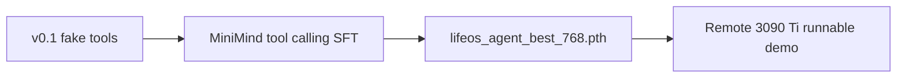
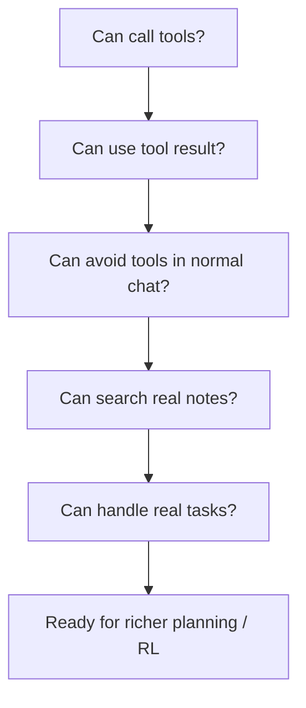

# LifeOS-Agent Roadmap

这份路线图描述从当前 `v0.1` 到真实 `LifeOS-Agent` 的推荐推进顺序。

## 当前状态



已经完成：

1. Tool Calling 外部循环
2. 3 个 fake tools
3. 私有 SFT seed 数据
4. 三轮远程训练
5. 最佳权重运行脚本
6. 批量验收脚本
7. 实现文档和训练文档

## 阶段 1：真实 Obsidian Markdown 检索

目标：

```text
search_fake_obsidian -> search_obsidian_markdown
```

建议顺序：

1. 支持配置 Obsidian vault 路径
2. 扫描 `.md` 文件
3. 提取 title、path、content snippet
4. 用关键词和标题匹配先跑通
5. 返回 top 3

暂时不需要：

1. 向量数据库
2. embedding
3. 自动写入笔记

## 阶段 2：真实任务工具

目标：

```text
list_today_tasks -> list_tasks_from_markdown
```

可以先从 Markdown 任务语法开始：

```markdown
- [ ] 整理 Tool Calling 笔记
- [ ] 复习 SFTDataset
```

建议功能：

1. 扫描今日笔记
2. 提取未完成任务
3. 返回固定 JSON
4. 保持工具 schema 不变，减少模型重训压力

## 阶段 3：更多工具

可以增加：

1. `open_note`
2. `summarize_note`
3. `list_recent_notes`
4. `create_daily_plan`

每加一个工具，都要同步补：

1. 工具 schema
2. Python 实现
3. router 规则
4. seed 训练样本
5. selftest case

## 阶段 4：训练数据扩充

当前 seed 是 `26` 条，只够做最小验证。

下一目标：

```text
26 -> 100 -> 300 -> 1000
```

优先补：

1. no-tool 普通聊天
2. 工具后二轮最终回答
3. 真实 Obsidian 问法
4. 任务规划问法
5. 工具参数 JSON 多样性

## 阶段 5：再考虑向量检索

当 Markdown 关键词检索稳定后，再上：

1. BM25
2. embedding
3. 向量数据库
4. hybrid search

判断是否该上向量检索的标准：

1. 标题和关键词搜不到足够内容
2. 用户问题更偏语义表达
3. 笔记规模已经足够大

## 阶段 6：Agentic RL

Agentic RL 不适合现在立刻做。

推荐开始时机：

1. 工具调用已经稳定
2. 工具结果能被稳定利用
3. 真实工具有明确可验证目标
4. 已经有一批失败样本可以转成训练数据

适合 RL 的任务：

1. 多步数学
2. 多轮搜索
3. 有明确最终答案的任务
4. 可以自动判分的工具链

## 判断项目进入下一阶段的信号



当前已经完成 A、B、C 的基础版本。下一步应该集中火力做 D：真实笔记检索。
