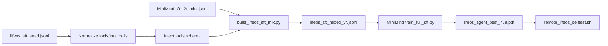
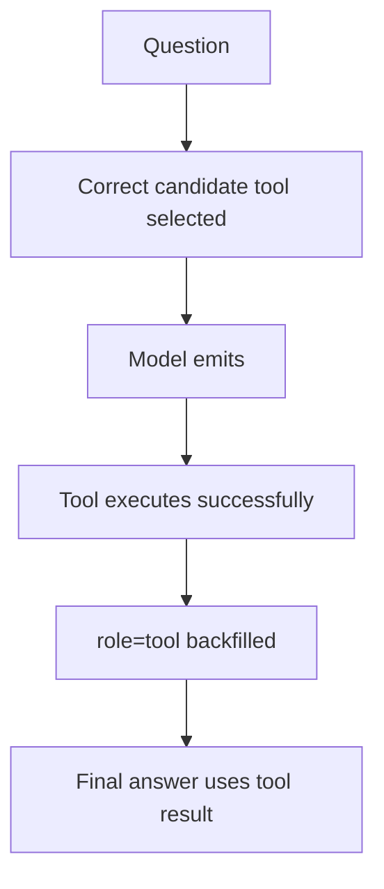

# Training Flow

这份文档解释 `LifeOS-Agent` 的训练闭环：数据从哪里来、怎样混合、三轮训练为什么这样安排，以及最后怎么验证。

## 1. 数据流



## 2. 为什么不是只训 seed 数据

`lifeos_sft_seed.jsonl` 是我们自己的高价值样本，但数量很少。只训它会让模型快速过拟合，表现为：

1. 只会背固定句式
2. 普通聊天能力下降
3. 第二轮回答更容易重复
4. 泛化到相似问题时不稳

所以训练集使用“官方通用 SFT + LifeOS seed 重复加权”的方式。

## 3. Seed 样本结构

一个工具调用样本大致长这样：

```json
{
  "conversations": [
    {"role": "system", "content": "你是 LifeOS-Agent..."},
    {"role": "user", "content": "我今天应该做什么？"},
    {"role": "assistant", "tool_calls": [{"name": "list_today_tasks", "arguments": {}}]},
    {"role": "tool", "content": "{\"tasks\":[\"整理 Tool Calling 笔记\",\"复习 SFTDataset\",\"跑通 LifeOS-Agent v0.1\"]}"},
    {"role": "assistant", "content": "你今天建议按这个顺序推进..."}
  ]
}
```

进入 MiniMind 训练前，builder 会把 `tool_calls` 转成字符串，并把相关工具 schema 注入 `system.tools`。

## 4. 三轮训练设计

| 轮次 | 输入数据 | 继续训练自 | 输出权重 | 目标 |
| --- | --- | --- | --- | --- |
| 第一轮 | `lifeos_sft_mixed.jsonl` | `pretrain_768.pth` | `full_sft_768.pth` | 跑通链路，验证训练环境 |
| 第二轮 | `lifeos_sft_mixed_v2.jsonl` | `full_sft_768.pth` | `lifeos_sft_768.pth` | 强化 tools schema -> tool_call |
| 第三轮 | `lifeos_sft_mixed_v3.jsonl` | `lifeos_sft_768.pth` | `lifeos_agent_best_768.pth` | 扩 seed，补 no-tool，形成当前最佳权重 |

## 5. 训练命令模板

远程环境：

```bash
ssh wsl-dev
source /home/caius/lead-3d/venv/bin/activate
```

构造混合数据：

```bash
cd /home/caius/projects/LifeOS-Agent
python scripts/build_lifeos_sft_mix.py \
  --official dataset/minimind_dataset/sft_t2t_mini.jsonl \
  --seed dataset/lifeos_sft_seed.jsonl \
  --output dataset/lifeos_sft_mixed_v3.jsonl \
  --official_limit 8000 \
  --seed_repeat 150
```

启动训练：

```bash
cd /home/caius/minimind/trainer
python train_full_sft.py \
  --data_path /home/caius/projects/LifeOS-Agent/dataset/lifeos_sft_mixed_v3.jsonl \
  --save_weight lifeos_agent_best \
  --hidden_size 768 \
  --num_hidden_layers 8 \
  --max_seq_len 768 \
  --batch_size 4 \
  --accumulation_steps 4 \
  --epochs 1 \
  --learning_rate 3e-6 \
  --save_interval 300 \
  --from_weight lifeos_sft \
  --num_workers 4
```

## 6. 验收标准



当前 4 个验收问题：

1. `我之前学 SFTDataset 学到哪了？`
2. `我今天应该做什么？`
3. `17.66 涨停价是多少？`
4. `你好，简单介绍一下你自己`

运行：

```bash
bash scripts/remote_lifeos_selftest.sh
```

## 7. 当前效果解读

当前最佳权重已经能稳定完成工具调用主链路。小模型在第二轮自然语言回答上仍然可能偶尔重复，因此运行时增加 fallback，用工具结果生成保底答案。

这个阶段的目标已经达成：模型学会“请求工具”，Python 学会“执行工具并回填”，系统可以作为真实 Obsidian 接入前的最小训练基线。
